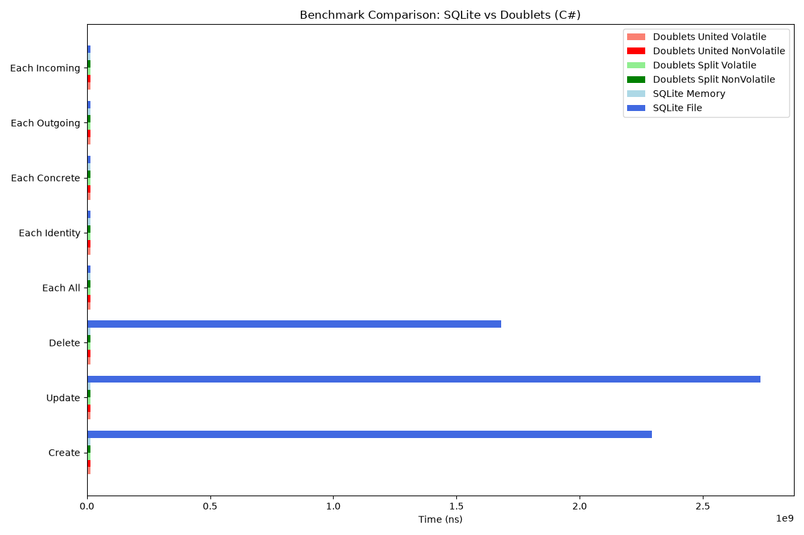
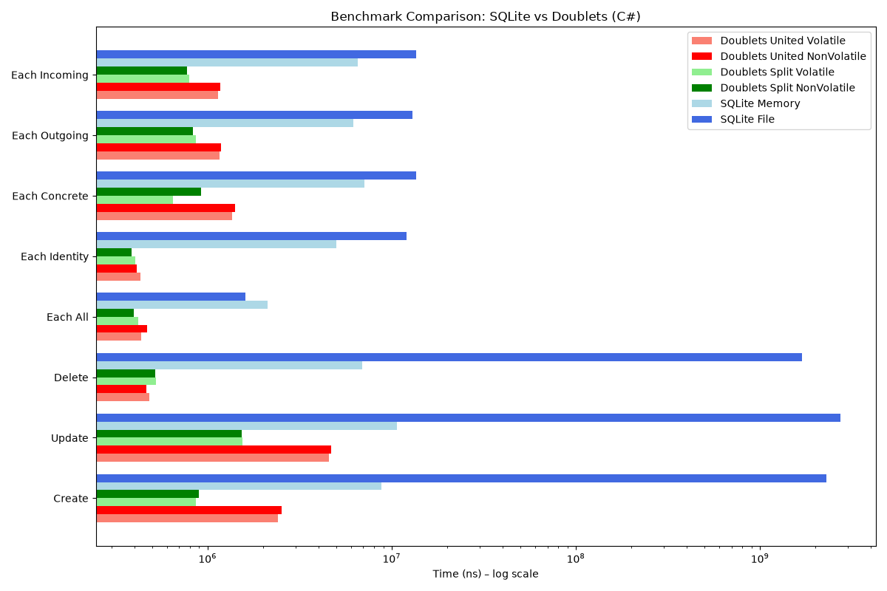

[](https://github.com/linksplatform/Comparisons.SQLiteVSDoublets/actions?workflow=CI)

# Comparisons.SQLiteVSDoublets ([русская версия](README.ru.md))


Comparison of SQLite and LinksPlatform's Doublets (links) on basic embedded database operations with links and object-like structures.

Based on examples from https://github.com/FahaoTang/dotnetcore-examples and https://github.com/Konard/LinksPlatform

## Automated benchmark suite

The comparison runs the same link workload against SQLite in-memory and file
databases and four Doublets layouts: united/split and volatile/non-volatile.
It measures create, update, delete, enumerate all, and queries by identity,
concrete `(source, target)`, outgoing source, and incoming target. The Rust
suite also measures creation, reading, and deletion of object-like blog posts
on every storage variant.

Preparation and cleanup are outside the measured region. Pull requests run a
reduced-scale validation and preserve raw output, tables, and charts as
workflow artifacts. Full runs on `main` publish the tables and charts below
with a link to the producing workflow run.

Run the checks locally:

```bash
cd rust
cargo test --lib --tests
cargo check --benches
BENCHMARK_LINK_COUNT=10 BACKGROUND_LINK_COUNT=30 \
  BENCHMARK_OBJECT_COUNT=5 cargo bench --bench bench -- \
  --output-format bencher

cd ../csharp
dotnet run -c Release -- --self-test
BENCHMARK_LINK_COUNT=10 BACKGROUND_LINK_COUNT=30 \
  dotnet run -c Release -- --filter '*LinksBenchmarks*'
```

### C# link results

<!--CSHARP_BENCHMARK_RESULTS_START-->
_Generated 2026-09-19 18:13 UTC for C# by [GitHub Actions run 35459522587](https://github.com/linksplatform/Comparisons.SQLiteVSDoublets/actions/runs/35459522587) — 1000 benchmarked links, 3000 background links._

| Operation     | Doublets United Volatile | Doublets United NonVolatile | Doublets Split Volatile | Doublets Split NonVolatile | SQLite Memory | SQLite File |
|---------------|--------------------------|-----------------------------|-------------------------|----------------------------|---------------|-------------|
| Create        | 2414327 (3.7x faster)    | 2512520 (3.5x faster)       | 867200 (10.2x faster)   | 896999 (9.8x faster)       | 8818051       | 2294476668  |
| Update        | 4566053 (2.3x faster)    | 4670899 (2.3x faster)       | 1541871 (7.0x faster)   | 1534119 (7.0x faster)      | 10720700      | 2733072615  |
| Delete        | 484008 (14.3x faster)    | 465524 (14.8x faster)       | 523910 (13.2x faster)   | 521322 (13.3x faster)      | 6907869       | 1682008343  |
| Each All      | 437356 (3.7x faster)     | 470885 (3.4x faster)        | 420518 (3.8x faster)    | 397666 (4.0x faster)       | 2113072       | 1598861     |
| Each Identity | 430962 (11.6x faster)    | 411173 (12.1x faster)       | 403128 (12.4x faster)   | 385531 (13.0x faster)      | 4995738       | 12044311    |
| Each Concrete | 1363130 (5.2x faster)    | 1408600 (5.1x faster)       | 647769 (11.0x faster)   | 917509 (7.8x faster)       | 7134655       | 13622920    |
| Each Outgoing | 1160157 (5.3x faster)    | 1180175 (5.3x faster)       | 862790 (7.2x faster)    | 830070 (7.5x faster)       | 6199124       | 12923172    |
| Each Incoming | 1139559 (5.7x faster)    | 1169325 (5.6x faster)       | 796694 (8.2x faster)    | 776158 (8.4x faster)       | 6533836       | 13510164    |




<!--CSHARP_BENCHMARK_RESULTS_END-->

### Rust link and object results

<!--RUST_BENCHMARK_RESULTS_START-->
> Results will be generated by the full benchmark workflow after this change
> reaches `main`.
<!--RUST_BENCHMARK_RESULTS_END-->

The original C# object comparison and its historical results remain below.

## SQLite
```C#
using System.Linq;
using Comparisons.SQLiteVSDoublets.Model;

namespace Comparisons.SQLiteVSDoublets.SQLite
{
    public class SQLiteTestRun : TestRun
    {
        public SQLiteTestRun(string dbFilename) : base(dbFilename) { }

        public override void Prepare()
        {
            using var dbContext = new SQLiteDbContext(DbFilename);
            dbContext.Database.EnsureCreated();
        }

        public override void CreateList()
        {
            using var dbContext = new SQLiteDbContext(DbFilename);
            dbContext.BlogPosts.AddRange(BlogPosts.List);
            dbContext.SaveChanges();
        }

        public override void ReadList()
        {
            using var dbContext = new SQLiteDbContext(DbFilename);
            foreach (var blogPost in dbContext.BlogPosts)
            {
                ReadBlogPosts.Add(blogPost);
            }
        }

        public override void DeleteList()
        {
            using var dbContext = new SQLiteDbContext(DbFilename);
            var blogPostsToDelete = dbContext.BlogPosts.ToList();
            dbContext.BlogPosts.RemoveRange(blogPostsToDelete);
            dbContext.SaveChanges();
        }
    }
}
```

## Doublets
``` C#
using System.IO;
using Platform.IO;
using Comparisons.SQLiteVSDoublets.Model;

namespace Comparisons.SQLiteVSDoublets.Doublets
{
    public class DoubletsTestRun : TestRun
    {
        public string DbIndexFilename { get; }

        public DoubletsTestRun(string dbFilename) : base(dbFilename) => DbIndexFilename = $"{Path.GetFileNameWithoutExtension(dbFilename)}.links.index";

        public override void Prepare()
        {
            using var dbContext = new DoubletsDbContext(DbFilename, DbIndexFilename);
        }

        public override void CreateList()
        {
            using var dbContext = new DoubletsDbContext(DbFilename, DbIndexFilename);
            foreach (var blogPost in BlogPosts.List)
            {
                dbContext.SaveBlogPost(blogPost);
            }
        }

        public override void ReadList()
        {
            using var dbContext = new DoubletsDbContext(DbFilename, DbIndexFilename);
            foreach (var blogPost in dbContext.BlogPosts)
            {
                ReadBlogPosts.Add(blogPost);
            }
        }

        public override void DeleteList()
        {
            using var dbContext = new DoubletsDbContext(DbFilename, DbIndexFilename);
            var blogPostsToDelete = dbContext.BlogPosts;
            foreach (var blogPost in blogPostsToDelete)
            {
                dbContext.Delete((uint)blogPost.Id);
            }
        }

        protected override void DeleteDatabase()
        {
            File.Delete(DbFilename);
            File.Delete(DbIndexFilename);
        }

        protected override long GetDatabaseSizeInBytes() => FileHelpers.GetSize(DbFilename) + FileHelpers.GetSize(DbIndexFilename);
    }
}
```

## [Result](https://www.icloud.com/keynote/0cYVNWkWD5RLU0k-XIBs3qWkA#Sqlite_vs_Doublets)

### Performance


### Disk usage


### RAM usage


### Source data
``` ini

BenchmarkDotNet=v0.12.0, OS=Windows 10.0.18362
Intel Core i7-6700K CPU 4.00GHz (Skylake), 1 CPU, 8 logical and 4 physical cores
.NET Core SDK=3.0.100
  [Host]     : .NET Core 3.0.0 (CoreCLR 4.700.19.46205, CoreFX 4.700.19.46214), X64 RyuJIT
  Job-AYEMIX : .NET Core 3.0.0 (CoreCLR 4.700.19.46205, CoreFX 4.700.19.46214), X64 RyuJIT

InvocationCount=1  IterationCount=1  UnrollFactor=1  
WarmupCount=2  

```
|   Method |      N |        Mean | Error |        Gen 0 |       Gen 1 | Gen 2 |   Allocated | SizeAfterCreation |
|--------- |------- |------------:|------:|-------------:|------------:|------:|------------:|------------------:|
|   **SQLite** |   **1000** |    **719.1 ms** |    **NA** |    **5000.0000** |           **-** |     **-** |    **30.67 MB** |            **925696** |
| Doublets |   1000 |    145.0 ms |    NA |   34000.0000 |   1000.0000 |     - |   139.37 MB |            767616 |
|   **SQLite** |  **10000** |  **2,770.3 ms** |    **NA** |   **64000.0000** |  **19000.0000** |     **-** |   **315.71 MB** |           **9056256** |
| Doublets |  10000 |  1,003.8 ms |    NA |  304000.0000 |  31000.0000 |     - |  1220.55 MB |           6528256 |
|   **SQLite** | **100000** | **35,853.8 ms** |    **NA** |  **680000.0000** | **151000.0000** |     **-** |  **3234.09 MB** |          **90890240** |
| Doublets | 100000 | 13,083.4 ms |    NA | 3088000.0000 | 328000.0000 |     - | 12356.33 MB |          64192256 |

## Conclusion

In this particular comparison, Doublets are faster and use less memory on disk, but this comes with the cost of additional use of RAM (Sqlite uses it less).
