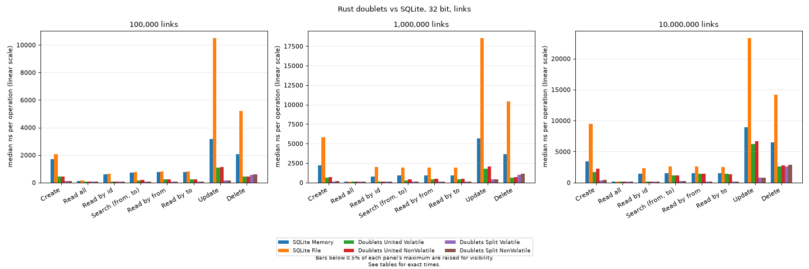
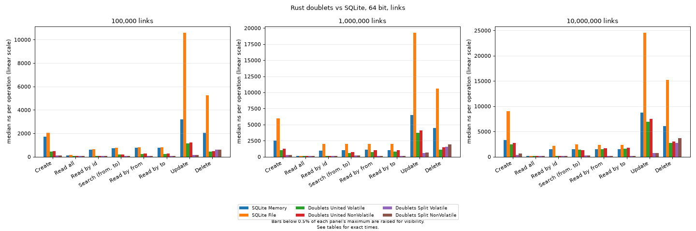
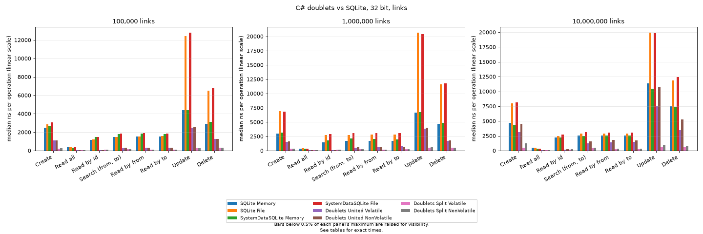
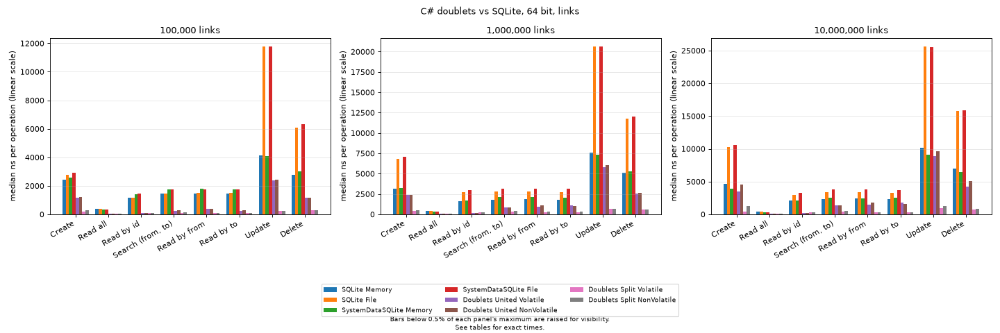
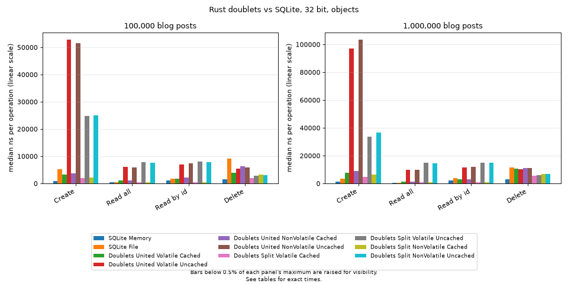
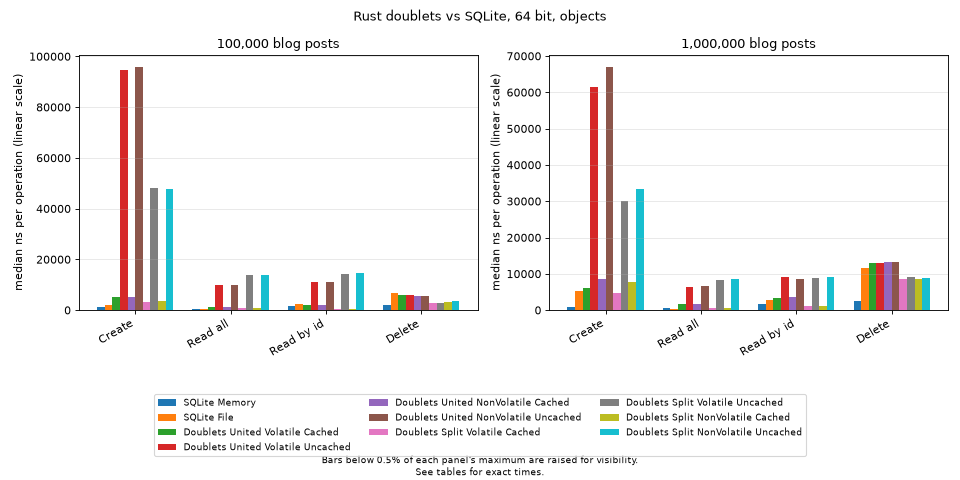
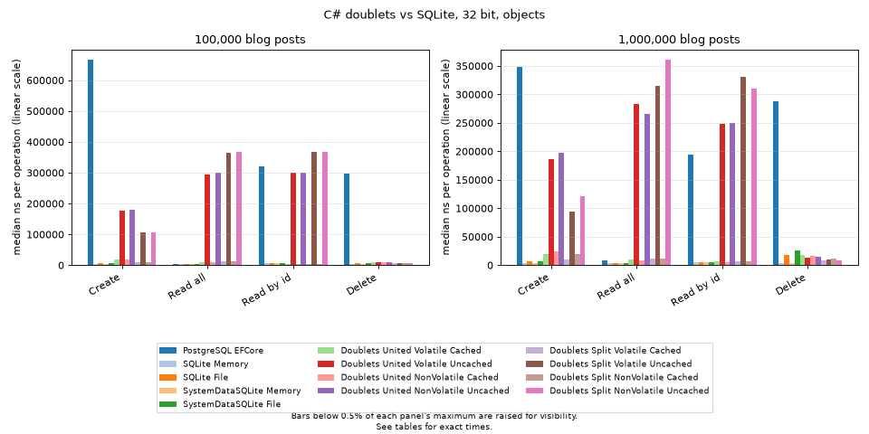
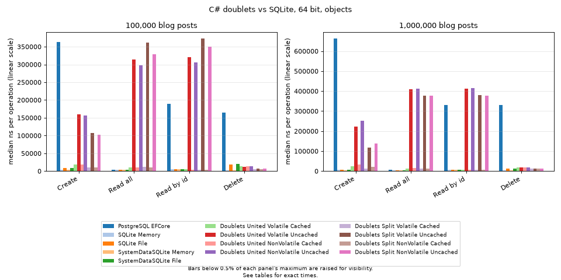

# Comparisons.SQLiteVSDoublets ([русская версия](README.ru.md))

[](https://github.com/linksplatform/Comparisons.SQLiteVSDoublets/actions/workflows/rust.yml)
[](https://github.com/linksplatform/Comparisons.SQLiteVSDoublets/actions/workflows/csharp.yml)
[](https://github.com/linksplatform/Comparisons.SQLiteVSDoublets/actions/workflows/benchmarks.yml)


Comparison of SQLite and LinksPlatform's Doublets (links) on basic embedded
database operations with links and object-like structures.

Based on examples from <https://github.com/FahaoTang/dotnetcore-examples> and
<https://github.com/Konard/LinksPlatform>

## Benchmarks

Rust ([doublets](https://crates.io/crates/doublets) and
[rusqlite](https://crates.io/crates/rusqlite) with bundled SQLite) and C#
([Platform.Data.Doublets](https://www.nuget.org/packages/Platform.Data.Doublets),
[Platform.Data.Doublets.Sequences](https://www.nuget.org/packages/Platform.Data.Doublets.Sequences)
and the providers [Microsoft.Data.Sqlite](https://www.nuget.org/packages/Microsoft.Data.Sqlite)
and [System.Data.SQLite](https://www.nuget.org/packages/System.Data.SQLite))
run the same workloads on the same deterministic data, with 32 bit
(`u32`/`uint`) and 64 bit (`u64`/`ulong`) ids:

- **Links**: SQLite stores the table
  `links(id INTEGER PRIMARY KEY, "from", "to")` with the indices
  `("from", "to")` and `("to", "from")`; Doublets stores the links themselves.
  The operations are create, read all, read by id, search by `(from, to)`,
  read by `from`, read by `to`, update (swap `from` and `to`) and delete.
- **Objects**: blog posts with a title, content and publication date. SQLite
  stores the table `blog_posts(id, title, content, publication_date)`;
  Doublets stores every post as links, with strings as sequences of Unicode
  symbols, like
  [Platform.Data.Doublets.Sequences](https://github.com/linksplatform/Data.Doublets.Sequences)
  does. The operations are create, read all, read by id and delete. Every
  Doublets store runs with and without a cache of the string sequences
  (`Cached`/`Uncached`).

Storages: SQLite in memory and in a file; Doublets united (one array of links
with index trees) and split (separate data and index arrays), each volatile
(in memory) and non-volatile (in memory-mapped files). Doublets are compared
with SQLite of the same durability: volatile with `SQLite Memory`,
non-volatile with `SQLite File`.

C# also runs `SystemDataSQLite_Memory` and `SystemDataSQLite_File` with
System.Data.SQLite 2.0.4. `SQLite_Memory` and `SQLite_File` use
Microsoft.Data.Sqlite. Both providers use the same schemas, parameterized
commands, immediate transactions and native `e_sqlite3` library supplied by
Microsoft.Data.Sqlite, on Linux, macOS and Windows. The JSON reports record
each provider and engine version in `sqlite_providers`. The System.Data.SQLite
rows compare with Microsoft.Data.Sqlite of the same durability. Published
tables from older runs include only the providers measured in those runs;
the next Benchmarks run adds the new rows.

C# object benchmarks also support `PostgreSQL_EFCore` using
[Npgsql.EntityFrameworkCore.PostgreSQL](https://www.npgsql.org/efcore/).
Set `POSTGRESQL_CONNECTION_STRING` to include it in the default object comparison;
embedded benchmarks work without a PostgreSQL server. Explicitly selecting it
without configuration fails with a setup message. Both id widths use the same
deterministic posts, scattered point reads, validated operations, warm-ups and
transaction boundaries as the other object stores. EF saves one post at a time,
clears tracking after each save, reads without tracking and deletes by id.
Each warm-up and repetition creates and drops its own generated schema; the
database and other schemas remain intact. The configured user needs permission
to connect and create schemas in a benchmark database.

PostgreSQL is a server database and EF Core adds ORM and network costs. Its row
shows absolute timings without an embedded-storage speed ratio. `server_bytes`
measures the benchmark table, indexes and TOAST storage after creation, shown in
a separate server-relations column; it excludes shared WAL, server memory and
local client files. JSON and generated tables record PostgreSQL, Npgsql EF Core
and EF Core versions. Existing published measurements stay intact. CI adds a
pinned PostgreSQL service to each C# object benchmark job so all compared
variants still run on the same machine. Set `POSTGRESQL_VERBOSE=1` to log EF
diagnostics to stderr; logging is off by default and sensitive values are disabled.

Every repetition runs on a fresh store in an empty directory, after discarded
warm-up repetitions on up to 10,000 records that run for at least a second, so
the .NET JIT has already optimized the code. Each operation is one
timed transaction over all records, point operations visit the records in a
scattered order, and each result is checked against the expected count and
order-sensitive checksum, so a storage that loses, duplicates or mixes up
records fails the run instead of being reported as fast. Repetitions are
`3,000,000 / size` for links and `500,000 / size` for objects, clamped to
`1..=10`. The tables show the median time per operation; a difference is
reported only if the interquartile ranges (the middle half) of the
repetitions do not overlap and the medians differ by more than 5%, otherwise
it is `≈ same`. The file size is measured after creation; Doublets files are
preallocated memory-mapped files, so small stores show the preallocation size.

Each results group includes linear and logarithmic charts. Linear charts raise
bars below 0.5% of the panel maximum for visibility; the tables retain exact
times. Provenance records the Doublets library and Rust compiler or .NET SDK
versions used for that run. Older reports without this metadata identify it
as missing rather than attributing current toolchains to past measurements.

Every table is measured by its own GitHub Actions job, with all variants on
the same runner, so that a difference is never a difference between machines,
by the [Benchmarks workflow](.github/workflows/benchmarks.yml): links with
100,000, 1,000,000 and 10,000,000 records and objects with 100,000 and
1,000,000 records. These are the largest sizes that fit into the 6 hour limit
of a job: one SQLite File repetition on 100,000,000 links did not finish in
4.5 hours
([run 37228604862](https://github.com/linksplatform/Comparisons.SQLiteVSDoublets/actions/runs/37228604862)),
and 1,000,000 blog posts already take an hour in C#. Pull requests check the
whole pipeline on 1,000 records, and pushes to `main` update the results below.
The workflow can also be started manually with other sizes.

Run locally:

```bash
mkdir -p results
cargo run --release --manifest-path rust/Cargo.toml -- \
  links 64 100000 --output results/links-rust-64-100000.json
dotnet run -c Release --project csharp/SQLiteVSDoublets -- \
  objects 32 1000 --variants SQLite_File,Doublets_Split_NonVolatile_Cached
dotnet run -c Release --project csharp/SQLiteVSDoublets -- \
  links 64 1000 --repetitions 3 \
  --variants SQLite_Memory,SystemDataSQLite_Memory \
  --output results/links-csharp-64-1000.json
python3 scripts/benchmark_provenance.py results/links-rust-64-100000.json \
  --toolchain "$(rustc --version)"
python3 scripts/benchmark_provenance.py results/links-csharp-64-1000.json \
  --toolchain ".NET SDK $(dotnet --version)"
# print the tables, add --readme README.md --charts docs/benchmarks to update
python3 scripts/benchmark_report.py results
```

Run a bounded PostgreSQL comparison:

```bash
docker run -d --name benchmark-postgres -p 127.0.0.1:5432:5432 \
  -e POSTGRES_USER=benchmark -e POSTGRES_PASSWORD=benchmark \
  -e POSTGRES_DB=benchmark postgres:18.3
export POSTGRESQL_CONNECTION_STRING='Host=127.0.0.1;Database=benchmark;Username=benchmark;Password=benchmark'
dotnet run -c Release --project csharp/SQLiteVSDoublets -- \
  objects 64 1000 --repetitions 3 \
  --variants SQLite_Memory,SQLite_File,PostgreSQL_EFCore \
  --output results/objects-csharp-64-1000.json
python3 scripts/benchmark_report.py results
python3 experiments/postgresql/check_reports.py
docker stop benchmark-postgres
docker rm benchmark-postgres
```

Notes:

- The split stores of doublets 0.5.0 (Rust) lose a link that is updated to
  reference itself, so the benchmark updates a link to `(0, 0)` first, which
  is the state links are created in
  ([experiments/split_store_delete](experiments/split_store_delete)).
- The stores of doublets 0.5.0 (Rust) take the part of the memory that
  `platform-mem` 0.3.0 returns after growing it for the whole memory, so a
  store fails after 1,040,384 links; the benchmarks wrap the memory in
  [`memory::Whole`](rust/src/memory.rs), which returns the whole memory
  ([experiments/unit_store_growth](experiments/unit_store_growth)).
- In C#, links are deleted with `Delete(id, handler: null)`, which resets the
  link before deleting it; the bare `Delete(id)` leaves the link in the index
  trees, and later searches fail
  ([experiments/csharp_tree_delete](experiments/csharp_tree_delete)).
- The C# united stores use AVL index trees: the default size balanced trees
  degenerate when many links share a source or a target, which makes each
  blog post creation linear in the number of posts
  ([experiments/csharp_objects_profile](experiments/csharp_objects_profile)).
- The C# split stores keep the default linked list of the internal sources,
  which doublets 0.5.0 (Rust) does not have; it makes the C# updates faster
  and the other operations take about the same time
  ([experiments/csharp_split_linked_list](experiments/csharp_split_linked_list)).
- Objects stores use external references for numbers and Unicode symbols, so
  raw values never collide with link ids.
- Reading a string without the cache walks its sequence link by link; in C#
  each `GetSource`/`GetTarget` call of `Platform.Data` allocates a handler and
  a list, which makes the uncached C# reads much slower than the Rust ones.

<!--BENCHMARK_RESULTS_START-->
<!-- markdownlint-disable MD013 MD024 -->
## Doublets vs SQLite as storage for links

### Rust doublets vs SQLite

#### 32 bit address/id space benchmarks

##### 100,000 links

_10 repetitions after a warm-up, median time per operation. SQLite 3.53.2; doublets 0.5.0; rustc 1.99.0 (b940084d7 2026-09-28). Ubuntu 24.04.5 LTS, AMD EPYC 7763 64-Core Processor, 4 cores, 16 GiB, [GitHub Actions run](https://github.com/linksplatform/Comparisons.SQLiteVSDoublets/actions/runs/37547766777) on 2026-10-06._

| Storage | Create | Read all | Read by id | Search (from, to) | Read by from | Read by to | Update | Delete | File size |
| --- | ---: | ---: | ---: | ---: | ---: | ---: | ---: | ---: | ---: |
| SQLite Memory | 1.71 µs | 130 ns | 605 ns | 728 ns | 764 ns | 768 ns | 3.17 µs | 2.06 µs | — |
| SQLite File | 2.06 µs | 135 ns | 624 ns | 766 ns | 796 ns | 802 ns | 10.5 µs | 5.2 µs | 4.4 MiB |
| Doublets United Volatile | 427 ns (4.01× faster) | 1.77 ns (73.2× faster) | 4.32 ns (140× faster) | 170 ns (4.29× faster) | 224 ns (3.42× faster) | 238 ns (3.23× faster) | 1.09 µs (2.9× faster) | 428 ns (4.82× faster) | — |
| Doublets United NonVolatile | 442 ns (4.66× faster) | 1.88 ns (71.9× faster) | 4.3 ns (145× faster) | 185 ns (4.13× faster) | 237 ns (3.36× faster) | 244 ns (3.29× faster) | 1.14 µs (9.25× faster) | 440 ns (11.8× faster) | 32.0 MiB |
| Doublets Split Volatile | 94.9 ns (18× faster) | 3.74 ns (34.7× faster) | 3.79 ns (160× faster) | 52.6 ns (13.8× faster) | 27.5 ns (27.8× faster) | 28.7 ns (26.7× faster) | 157 ns (20.2× faster) | 557 ns (3.7× faster) | — |
| Doublets Split NonVolatile | 97.7 ns (21.1× faster) | 3.74 ns (36.2× faster) | 3.94 ns (158× faster) | 54.5 ns (14.1× faster) | 28.6 ns (27.9× faster) | 29.9 ns (26.8× faster) | 165 ns (63.8× faster) | 587 ns (8.86× faster) | 40.0 MiB |

##### 1,000,000 links

_3 repetitions after a warm-up, median time per operation. SQLite 3.53.2; doublets 0.5.0; rustc 1.99.0 (b940084d7 2026-09-28). Ubuntu 24.04.5 LTS, AMD EPYC 7763 64-Core Processor, 4 cores, 16 GiB, [GitHub Actions run](https://github.com/linksplatform/Comparisons.SQLiteVSDoublets/actions/runs/37547766777) on 2026-10-06._

| Storage | Create | Read all | Read by id | Search (from, to) | Read by from | Read by to | Update | Delete | File size |
| --- | ---: | ---: | ---: | ---: | ---: | ---: | ---: | ---: | ---: |
| SQLite Memory | 2.23 µs | 126 ns | 782 ns | 917 ns | 935 ns | 937 ns | 5.64 µs | 3.66 µs | — |
| SQLite File | 5.82 µs | 131 ns | 1.96 µs | 1.89 µs | 1.92 µs | 1.91 µs | 18.6 µs | 10.4 µs | 48.2 MiB |
| Doublets United Volatile | 632 ns (3.53× faster) | 1.91 ns (66.2× faster) | 14.1 ns (55.6× faster) | 301 ns (3.04× faster) | 405 ns (2.31× faster) | 413 ns (2.27× faster) | 1.79 µs (3.15× faster) | 663 ns (5.52× faster) | — |
| Doublets United NonVolatile | 718 ns (8.11× faster) | 2.16 ns (60.7× faster) | 18.7 ns (105× faster) | 379 ns (4.99× faster) | 479 ns (4× faster) | 480 ns (3.98× faster) | 2.08 µs (8.93× faster) | 719 ns (14.5× faster) | 32.0 MiB |
| Doublets Split Volatile | 129 ns (17.3× faster) | 3.86 ns (32.8× faster) | 19.9 ns (39.2× faster) | 124 ns (7.42× faster) | 89.2 ns (10.5× faster) | 85.4 ns (11× faster) | 384 ns (14.7× faster) | 1.01 µs (3.63× faster) | — |
| Doublets Split NonVolatile | 167 ns (34.9× faster) | 3.92 ns (33.4× faster) | 23.1 ns (85.1× faster) | 151 ns (12.5× faster) | 93.8 ns (20.4× faster) | 99.2 ns (19.3× faster) | 435 ns (42.7× faster) | 1.16 µs (8.96× faster) | 40.0 MiB |

##### 10,000,000 links

_1 repetition after a warm-up, median time per operation. SQLite 3.53.2; doublets 0.5.0; rustc 1.99.0 (b940084d7 2026-09-28). Ubuntu 24.04.5 LTS, AMD EPYC 7763 64-Core Processor, 4 cores, 16 GiB, [GitHub Actions run](https://github.com/linksplatform/Comparisons.SQLiteVSDoublets/actions/runs/37547766777) on 2026-10-07._

| Storage | Create | Read all | Read by id | Search (from, to) | Read by from | Read by to | Update | Delete | File size |
| --- | ---: | ---: | ---: | ---: | ---: | ---: | ---: | ---: | ---: |
| SQLite Memory | 3.46 µs | 128 ns | 1.4 µs | 1.52 µs | 1.47 µs | 1.49 µs | 8.9 µs | 6.5 µs | — |
| SQLite File | 9.43 µs | 131 ns | 2.32 µs | 2.64 µs | 2.6 µs | 2.54 µs | 23.3 µs | 14.2 µs | 501.0 MiB |
| Doublets United Volatile | 1.67 µs (2.07× faster) | 2.19 ns (58.6× faster) | 33.5 ns (41.8× faster) | 1.11 µs (1.37× faster) | 1.39 µs (1.06× faster) | 1.47 µs (≈ same) | 6.24 µs (1.43× faster) | 2.61 µs (2.5× faster) | — |
| Doublets United NonVolatile | 2.21 µs (4.27× faster) | 2.37 ns (55.5× faster) | 32.7 ns (70.9× faster) | 1.12 µs (2.35× faster) | 1.43 µs (1.82× faster) | 1.35 µs (1.88× faster) | 6.65 µs (3.51× faster) | 2.8 µs (5.05× faster) | 320.0 MiB |
| Doublets Split Volatile | 304 ns (11.4× faster) | 3.88 ns (33.1× faster) | 31.2 ns (44.9× faster) | 238 ns (6.39× faster) | 174 ns (8.44× faster) | 172 ns (8.7× faster) | 765 ns (11.6× faster) | 2.64 µs (2.46× faster) | — |
| Doublets Split NonVolatile | 444 ns (21.2× faster) | 3.9 ns (33.7× faster) | 32.7 ns (70.9× faster) | 242 ns (10.9× faster) | 177 ns (14.7× faster) | 178 ns (14.3× faster) | 759 ns (30.8× faster) | 2.91 µs (4.87× faster) | 400.0 MiB |




#### 64 bit address/id space benchmarks

##### 100,000 links

_10 repetitions after a warm-up, median time per operation. SQLite 3.53.2; doublets 0.5.0; rustc 1.99.0 (b940084d7 2026-09-28). Ubuntu 24.04.5 LTS, Intel(R) Xeon(R) Platinum 8370C CPU @ 2.80GHz, 4 cores, 16 GiB, [GitHub Actions run](https://github.com/linksplatform/Comparisons.SQLiteVSDoublets/actions/runs/37547766777) on 2026-10-06._

| Storage | Create | Read all | Read by id | Search (from, to) | Read by from | Read by to | Update | Delete | File size |
| --- | ---: | ---: | ---: | ---: | ---: | ---: | ---: | ---: | ---: |
| SQLite Memory | 1.56 µs | 107 ns | 551 ns | 621 ns | 670 ns | 670 ns | 3.05 µs | 2.04 µs | — |
| SQLite File | 1.77 µs | 110 ns | 571 ns | 661 ns | 704 ns | 705 ns | 7.49 µs | 3.98 µs | 4.4 MiB |
| Doublets United Volatile | 476 ns (3.27× faster) | 2.89 ns (36.8× faster) | 6.43 ns (85.6× faster) | 205 ns (3.03× faster) | 267 ns (2.51× faster) | 271 ns (2.47× faster) | 1.31 µs (2.33× faster) | 505 ns (4.04× faster) | — |
| Doublets United NonVolatile | 509 ns (3.48× faster) | 3.59 ns (30.5× faster) | 7.13 ns (80.1× faster) | 225 ns (2.94× faster) | 279 ns (2.52× faster) | 277 ns (2.54× faster) | 1.38 µs (5.44× faster) | 508 ns (7.84× faster) | 64.0 MiB |
| Doublets Split Volatile | 109 ns (14.2× faster) | 3.65 ns (29.2× faster) | 6.23 ns (88.4× faster) | 64.9 ns (9.56× faster) | 38.9 ns (17.2× faster) | 40.6 ns (16.5× faster) | 200 ns (15.2× faster) | 659 ns (3.1× faster) | — |
| Doublets Split NonVolatile | 113 ns (15.7× faster) | 3.84 ns (28.6× faster) | 6.73 ns (84.8× faster) | 67.5 ns (9.79× faster) | 42.2 ns (16.7× faster) | 42.5 ns (16.6× faster) | 210 ns (35.7× faster) | 719 ns (5.54× faster) | 80.0 MiB |

##### 1,000,000 links

_3 repetitions after a warm-up, median time per operation. SQLite 3.53.2; doublets 0.5.0; rustc 1.99.0 (b940084d7 2026-09-28). Ubuntu 24.04.5 LTS, AMD EPYC 9V74 80-Core Processor, 4 cores, 16 GiB, [GitHub Actions run](https://github.com/linksplatform/Comparisons.SQLiteVSDoublets/actions/runs/37547766777) on 2026-10-06._

| Storage | Create | Read all | Read by id | Search (from, to) | Read by from | Read by to | Update | Delete | File size |
| --- | ---: | ---: | ---: | ---: | ---: | ---: | ---: | ---: | ---: |
| SQLite Memory | 2 µs | 99.8 ns | 738 ns | 811 ns | 907 ns | 840 ns | 6.25 µs | 4 µs | — |
| SQLite File | 5.57 µs | 99.2 ns | 1.75 µs | 1.68 µs | 1.7 µs | 1.69 µs | 18.6 µs | 10.6 µs | 48.2 MiB |
| Doublets United Volatile | 854 ns (2.34× faster) | 2.07 ns (48.2× faster) | 22.2 ns (33.3× faster) | 527 ns (1.54× faster) | 662 ns (1.37× faster) | 742 ns (1.13× faster) | 3.12 µs (2× faster) | 1.05 µs (3.82× faster) | — |
| Doublets United NonVolatile | 1.09 µs (5.13× faster) | 1.88 ns (52.8× faster) | 24.4 ns (71.6× faster) | 669 ns (2.51× faster) | 893 ns (1.9× faster) | 926 ns (1.82× faster) | 3.68 µs (5.06× faster) | 1.21 µs (8.74× faster) | 64.0 MiB |
| Doublets Split Volatile | 216 ns (9.25× faster) | 3.66 ns (27.3× faster) | 23.6 ns (31.3× faster) | 181 ns (4.49× faster) | 133 ns (6.81× faster) | 142 ns (5.92× faster) | 495 ns (12.6× faster) | 1.32 µs (3.04× faster) | — |
| Doublets Split NonVolatile | 236 ns (23.6× faster) | 4.13 ns (24× faster) | 25.4 ns (68.6× faster) | 194 ns (8.62× faster) | 141 ns (12× faster) | 146 ns (11.5× faster) | 531 ns (35.1× faster) | 1.57 µs (6.73× faster) | 80.0 MiB |

##### 10,000,000 links

_1 repetition after a warm-up, median time per operation. SQLite 3.53.2; doublets 0.5.0; rustc 1.99.0 (b940084d7 2026-09-28). Ubuntu 24.04.5 LTS, AMD EPYC 9V45 96-Core Processor, 4 cores, 16 GiB, [GitHub Actions run](https://github.com/linksplatform/Comparisons.SQLiteVSDoublets/actions/runs/37547766777) on 2026-10-06._

| Storage | Create | Read all | Read by id | Search (from, to) | Read by from | Read by to | Update | Delete | File size |
| --- | ---: | ---: | ---: | ---: | ---: | ---: | ---: | ---: | ---: |
| SQLite Memory | 2.85 µs | 67.5 ns | 1.26 µs | 1.35 µs | 1.28 µs | 1.29 µs | 8.98 µs | 6.54 µs | — |
| SQLite File | 6.56 µs | 69.1 ns | 1.51 µs | 1.8 µs | 1.72 µs | 1.74 µs | 16.6 µs | 10 µs | 501.0 MiB |
| Doublets United Volatile | 2.33 µs (1.23× faster) | 1.89 ns (35.7× faster) | 24.4 ns (51.5× faster) | 1.31 µs (≈ same) | 1.48 µs (1.16× slower) | 1.47 µs (1.14× slower) | 6.13 µs (1.47× faster) | 2.68 µs (2.44× faster) | — |
| Doublets United NonVolatile | 3.06 µs (2.14× faster) | 1.89 ns (36.5× faster) | 25.6 ns (59× faster) | 1.52 µs (1.18× faster) | 1.88 µs (1.09× slower) | 1.87 µs (1.07× slower) | 8.08 µs (2.05× faster) | 3.46 µs (2.9× faster) | 640.0 MiB |
| Doublets Split Volatile | 416 ns (6.84× faster) | 2.74 ns (24.6× faster) | 25.1 ns (50.1× faster) | 267 ns (5.06× faster) | 152 ns (8.42× faster) | 156 ns (8.33× faster) | 702 ns (12.8× faster) | 3.02 µs (2.16× faster) | — |
| Doublets Split NonVolatile | 625 ns (10.5× faster) | 2.63 ns (26.3× faster) | 26.4 ns (57.2× faster) | 268 ns (6.69× faster) | 146 ns (11.8× faster) | 151 ns (11.5× faster) | 710 ns (23.3× faster) | 3.65 µs (2.74× faster) | 800.0 MiB |




### C# doublets vs SQLite

#### 32 bit address/id space benchmarks

##### 100,000 links

_10 repetitions after a warm-up, median time per operation. SQLite 3.53.3; Platform.Data.Doublets 0.18.1; .NET SDK 10.0.401. Ubuntu 24.04.5 LTS, AMD EPYC 9V45 96-Core Processor, 4 cores, 16 GiB, [GitHub Actions run](https://github.com/linksplatform/Comparisons.SQLiteVSDoublets/actions/runs/37547766777) on 2026-10-06._

| Storage | Create | Read all | Read by id | Search (from, to) | Read by from | Read by to | Update | Delete | File size |
| --- | ---: | ---: | ---: | ---: | ---: | ---: | ---: | ---: | ---: |
| SQLite Memory | 1.45 µs | 306 ns | 733 ns | 882 ns | 946 ns | 952 ns | 2.56 µs | 1.71 µs | — |
| SQLite File | 1.92 µs | 313 ns | 765 ns | 905 ns | 977 ns | 977 ns | 8.93 µs | 4.56 µs | 4.4 MiB |
| SystemDataSQLite Memory | 1.53 µs (1.06× slower) | 183 ns (1.67× faster) | 859 ns (1.17× slower) | 1.02 µs (1.16× slower) | 1.06 µs (1.12× slower) | 1.05 µs (1.11× slower) | 2.69 µs (1.05× slower) | 1.88 µs (1.1× slower) | — |
| SystemDataSQLite File | 1.81 µs (≈ same) | 187 ns (1.68× faster) | 854 ns (1.12× slower) | 1.01 µs (1.12× slower) | 1.06 µs (1.08× slower) | 1.02 µs (≈ same) | 8.45 µs (≈ same) | 4.37 µs (≈ same) | 4.4 MiB |
| Doublets United Volatile | 595 ns (2.44× faster) | 7.36 ns (41.5× faster) | 27.8 ns (26.4× faster) | 146 ns (6.03× faster) | 232 ns (4.08× faster) | 182 ns (5.23× faster) | 1.31 µs (1.95× faster) | 633 ns (2.71× faster) | — |
| Doublets United NonVolatile | 638 ns (3.01× faster) | 7.59 ns (41.2× faster) | 29 ns (26.4× faster) | 151 ns (5.98× faster) | 250 ns (3.92× faster) | 192 ns (5.1× faster) | 1.34 µs (6.67× faster) | 647 ns (7.05× faster) | 32.0 MiB |
| Doublets Split Volatile | 108 ns (13.4× faster) | 6.87 ns (44.5× faster) | 34.4 ns (21.3× faster) | 54.3 ns (16.2× faster) | 49.6 ns (19.1× faster) | 47.6 ns (20× faster) | 127 ns (20.2× faster) | 152 ns (11.3× faster) | — |
| Doublets Split NonVolatile | 148 ns (13× faster) | 7.07 ns (44.2× faster) | 34.8 ns (22× faster) | 55.5 ns (16.3× faster) | 50.6 ns (19.3× faster) | 49.9 ns (19.6× faster) | 131 ns (68.2× faster) | 147 ns (30.9× faster) | 40.0 MiB |

##### 1,000,000 links

_3 repetitions after a warm-up, median time per operation. SQLite 3.53.3; Platform.Data.Doublets 0.18.1; .NET SDK 10.0.401. Ubuntu 24.04.5 LTS, AMD EPYC 7763 64-Core Processor, 4 cores, 16 GiB, [GitHub Actions run](https://github.com/linksplatform/Comparisons.SQLiteVSDoublets/actions/runs/37547766777) on 2026-10-06._

| Storage | Create | Read all | Read by id | Search (from, to) | Read by from | Read by to | Update | Delete | File size |
| --- | ---: | ---: | ---: | ---: | ---: | ---: | ---: | ---: | ---: |
| SQLite Memory | 3.34 µs | 380 ns | 1.64 µs | 1.83 µs | 1.86 µs | 1.9 µs | 7.88 µs | 5.65 µs | — |
| SQLite File | 7.07 µs | 387 ns | 2.82 µs | 2.88 µs | 2.91 µs | 2.94 µs | 21.3 µs | 12.1 µs | 48.2 MiB |
| SystemDataSQLite Memory | 3.33 µs (≈ same) | 317 ns (1.2× faster) | 1.89 µs (1.15× slower) | 2.15 µs (1.18× slower) | 2.18 µs (1.17× slower) | 2.22 µs (1.17× slower) | 7.26 µs (1.08× faster) | 5.09 µs (1.11× faster) | — |
| SystemDataSQLite File | 7.06 µs (≈ same) | 322 ns (1.2× faster) | 3.01 µs (1.07× slower) | 3.12 µs (1.08× slower) | 3.18 µs (1.09× slower) | 3.16 µs (1.08× slower) | 20.7 µs (≈ same) | 12.1 µs (≈ same) | 48.2 MiB |
| Doublets United Volatile | 1.73 µs (1.93× faster) | 15.1 ns (25.2× faster) | 97.2 ns (16.9× faster) | 573 ns (3.19× faster) | 705 ns (2.64× faster) | 807 ns (2.36× faster) | 4.25 µs (1.85× faster) | 1.89 µs (2.99× faster) | — |
| Doublets United NonVolatile | 1.75 µs (4.05× faster) | 14.8 ns (26.2× faster) | 107 ns (26.4× faster) | 628 ns (4.58× faster) | 777 ns (3.75× faster) | 765 ns (3.84× faster) | 4.59 µs (4.65× faster) | 1.98 µs (6.12× faster) | 32.0 MiB |
| Doublets Split Volatile | 323 ns (10.3× faster) | 11.3 ns (33.7× faster) | 134 ns (12.3× faster) | 263 ns (6.95× faster) | 215 ns (8.66× faster) | 219 ns (8.7× faster) | 584 ns (13.5× faster) | 505 ns (11.2× faster) | — |
| Doublets Split NonVolatile | 381 ns (18.6× faster) | 11.4 ns (34.1× faster) | 144 ns (19.6× faster) | 290 ns (9.94× faster) | 221 ns (13.2× faster) | 223 ns (13.2× faster) | 608 ns (35.1× faster) | 495 ns (24.5× faster) | 40.0 MiB |

##### 10,000,000 links

_1 repetition after a warm-up, median time per operation. SQLite 3.53.3; Platform.Data.Doublets 0.18.1; .NET SDK 10.0.401. Ubuntu 24.04.5 LTS, AMD EPYC 7763 64-Core Processor, 4 cores, 16 GiB, [GitHub Actions run](https://github.com/linksplatform/Comparisons.SQLiteVSDoublets/actions/runs/37547766777) on 2026-10-07._

| Storage | Create | Read all | Read by id | Search (from, to) | Read by from | Read by to | Update | Delete | File size |
| --- | ---: | ---: | ---: | ---: | ---: | ---: | ---: | ---: | ---: |
| SQLite Memory | 4.06 µs | 381 ns | 1.89 µs | 2.22 µs | 2.2 µs | 2.19 µs | 9.48 µs | 6.29 µs | — |
| SQLite File | 10.1 µs | 383 ns | 2.95 µs | 3.46 µs | 3.39 µs | 3.38 µs | 25.1 µs | 15.6 µs | 501.0 MiB |
| SystemDataSQLite Memory | 3.96 µs (≈ same) | 310 ns (1.23× faster) | 2.17 µs (1.15× slower) | 2.49 µs (1.12× slower) | 2.45 µs (1.11× slower) | 2.4 µs (1.1× slower) | 8.99 µs (1.05× faster) | 6.09 µs (≈ same) | — |
| SystemDataSQLite File | 10.4 µs (≈ same) | 315 ns (1.22× faster) | 3.19 µs (1.08× slower) | 3.74 µs (1.08× slower) | 3.62 µs (1.07× slower) | 3.63 µs (1.07× slower) | 25.6 µs (≈ same) | 15.8 µs (≈ same) | 501.0 MiB |
| Doublets United Volatile | 3.05 µs (1.33× faster) | 14.6 ns (26.2× faster) | 157 ns (12× faster) | 1.1 µs (2.02× faster) | 1.26 µs (1.74× faster) | 1.04 µs (2.09× faster) | 6.78 µs (1.4× faster) | 3.22 µs (1.95× faster) | — |
| Doublets United NonVolatile | 3.81 µs (2.66× faster) | 14.5 ns (26.3× faster) | 181 ns (16.3× faster) | 1.37 µs (2.52× faster) | 1.83 µs (1.86× faster) | 1.66 µs (2.04× faster) | 8.9 µs (2.82× faster) | 4.32 µs (3.62× faster) | 320.0 MiB |
| Doublets Split Volatile | 452 ns (8.99× faster) | 14.1 ns (26.9× faster) | 259 ns (7.29× faster) | 395 ns (5.62× faster) | 287 ns (7.65× faster) | 310 ns (7.06× faster) | 784 ns (12.1× faster) | 646 ns (9.74× faster) | — |
| Doublets Split NonVolatile | 796 ns (12.7× faster) | 14.2 ns (27.1× faster) | 316 ns (9.34× faster) | 475 ns (7.29× faster) | 328 ns (10.3× faster) | 345 ns (9.81× faster) | 903 ns (27.8× faster) | 750 ns (20.8× faster) | 400.0 MiB |




#### 64 bit address/id space benchmarks

##### 100,000 links

_10 repetitions after a warm-up, median time per operation. SQLite 3.53.3; Platform.Data.Doublets 0.18.1; .NET SDK 10.0.401. Ubuntu 24.04.5 LTS, AMD EPYC 7763 64-Core Processor, 4 cores, 16 GiB, [GitHub Actions run](https://github.com/linksplatform/Comparisons.SQLiteVSDoublets/actions/runs/37547766777) on 2026-10-06._

| Storage | Create | Read all | Read by id | Search (from, to) | Read by from | Read by to | Update | Delete | File size |
| --- | ---: | ---: | ---: | ---: | ---: | ---: | ---: | ---: | ---: |
| SQLite Memory | 2.45 µs | 397 ns | 1.15 µs | 1.44 µs | 1.48 µs | 1.48 µs | 4.16 µs | 2.8 µs | — |
| SQLite File | 2.78 µs | 400 ns | 1.16 µs | 1.46 µs | 1.48 µs | 1.5 µs | 11.8 µs | 6.11 µs | 4.4 MiB |
| SystemDataSQLite Memory | 2.58 µs (1.05× slower) | 331 ns (1.2× faster) | 1.43 µs (1.25× slower) | 1.74 µs (1.21× slower) | 1.78 µs (1.2× slower) | 1.74 µs (1.17× slower) | 4.1 µs (≈ same) | 3.02 µs (1.08× slower) | — |
| SystemDataSQLite File | 2.91 µs (≈ same) | 336 ns (1.19× faster) | 1.43 µs (1.23× slower) | 1.75 µs (1.19× slower) | 1.77 µs (1.19× slower) | 1.74 µs (1.16× slower) | 11.8 µs (≈ same) | 6.34 µs (≈ same) | 4.4 MiB |
| Doublets United Volatile | 1.19 µs (2.06× faster) | 21.8 ns (18.2× faster) | 75.7 ns (15.2× faster) | 257 ns (5.61× faster) | 366 ns (4.05× faster) | 263 ns (5.62× faster) | 2.38 µs (1.75× faster) | 1.16 µs (2.42× faster) | — |
| Doublets United NonVolatile | 1.21 µs (2.3× faster) | 22.1 ns (18.1× faster) | 73.3 ns (15.9× faster) | 271 ns (5.4× faster) | 383 ns (3.88× faster) | 283 ns (5.29× faster) | 2.43 µs (4.85× faster) | 1.19 µs (5.15× faster) | 64.0 MiB |
| Doublets Split Volatile | 197 ns (12.4× faster) | 11.4 ns (34.7× faster) | 81.9 ns (14× faster) | 111 ns (13× faster) | 85.2 ns (17.4× faster) | 85.5 ns (17.3× faster) | 221 ns (18.8× faster) | 284 ns (9.84× faster) | — |
| Doublets Split NonVolatile | 271 ns (10.3× faster) | 11.8 ns (33.9× faster) | 82.3 ns (14.1× faster) | 119 ns (12.3× faster) | 94.1 ns (15.8× faster) | 92 ns (16.3× faster) | 235 ns (50.1× faster) | 265 ns (23× faster) | 80.0 MiB |

##### 1,000,000 links

_3 repetitions after a warm-up, median time per operation. SQLite 3.53.3; Platform.Data.Doublets 0.18.1; .NET SDK 10.0.401. Ubuntu 24.04.5 LTS, AMD EPYC 7763 64-Core Processor, 4 cores, 16 GiB, [GitHub Actions run](https://github.com/linksplatform/Comparisons.SQLiteVSDoublets/actions/runs/37547766777) on 2026-10-06._

| Storage | Create | Read all | Read by id | Search (from, to) | Read by from | Read by to | Update | Delete | File size |
| --- | ---: | ---: | ---: | ---: | ---: | ---: | ---: | ---: | ---: |
| SQLite Memory | 3.12 µs | 379 ns | 1.63 µs | 1.77 µs | 1.83 µs | 1.78 µs | 7.61 µs | 5.07 µs | — |
| SQLite File | 6.83 µs | 383 ns | 2.71 µs | 2.79 µs | 2.82 µs | 2.76 µs | 20.7 µs | 11.7 µs | 48.2 MiB |
| SystemDataSQLite Memory | 3.26 µs (≈ same) | 319 ns (1.19× faster) | 1.68 µs (≈ same) | 2.12 µs (1.2× slower) | 2.16 µs (1.18× slower) | 2.08 µs (1.17× slower) | 7.31 µs (≈ same) | 5.25 µs (≈ same) | — |
| SystemDataSQLite File | 7.06 µs (≈ same) | 323 ns (1.19× faster) | 2.99 µs (1.1× slower) | 3.15 µs (1.13× slower) | 3.14 µs (1.11× slower) | 3.15 µs (1.14× slower) | 20.7 µs (≈ same) | 12 µs (≈ same) | 48.2 MiB |
| Doublets United Volatile | 2.4 µs (1.3× faster) | 22.4 ns (17× faster) | 151 ns (10.8× faster) | 837 ns (2.11× faster) | 957 ns (1.91× faster) | 1.08 µs (1.64× faster) | 5.79 µs (1.31× faster) | 2.51 µs (2.02× faster) | — |
| Doublets United NonVolatile | 2.4 µs (2.85× faster) | 22.4 ns (17.1× faster) | 169 ns (16.1× faster) | 876 ns (3.18× faster) | 1.07 µs (2.65× faster) | 1.05 µs (2.63× faster) | 6.08 µs (3.4× faster) | 2.64 µs (4.45× faster) | 64.0 MiB |
| Doublets Split Volatile | 389 ns (8.04× faster) | 12 ns (31.5× faster) | 209 ns (7.82× faster) | 361 ns (4.89× faster) | 270 ns (6.78× faster) | 274 ns (6.47× faster) | 687 ns (11.1× faster) | 592 ns (8.56× faster) | — |
| Doublets Split NonVolatile | 500 ns (13.7× faster) | 12.7 ns (30.1× faster) | 249 ns (10.9× faster) | 404 ns (6.91× faster) | 295 ns (9.55× faster) | 305 ns (9.07× faster) | 706 ns (29.3× faster) | 596 ns (19.7× faster) | 80.0 MiB |

##### 10,000,000 links

_1 repetition after a warm-up, median time per operation. SQLite 3.53.3; Platform.Data.Doublets 0.18.1; .NET SDK 10.0.401. Ubuntu 24.04.5 LTS, AMD EPYC 7763 64-Core Processor, 4 cores, 16 GiB, [GitHub Actions run](https://github.com/linksplatform/Comparisons.SQLiteVSDoublets/actions/runs/37547766777) on 2026-10-07._

| Storage | Create | Read all | Read by id | Search (from, to) | Read by from | Read by to | Update | Delete | File size |
| --- | ---: | ---: | ---: | ---: | ---: | ---: | ---: | ---: | ---: |
| SQLite Memory | 4.64 µs | 379 ns | 2.14 µs | 2.37 µs | 2.44 µs | 2.37 µs | 10.1 µs | 7.03 µs | — |
| SQLite File | 10.3 µs | 380 ns | 2.92 µs | 3.38 µs | 3.34 µs | 3.29 µs | 25.6 µs | 15.8 µs | 501.0 MiB |
| SystemDataSQLite Memory | 3.95 µs (1.17× faster) | 315 ns (1.2× faster) | 2.16 µs (≈ same) | 2.53 µs (1.07× slower) | 2.47 µs (≈ same) | 2.49 µs (≈ same) | 9.09 µs (1.11× faster) | 6.42 µs (1.09× faster) | — |
| SystemDataSQLite File | 10.6 µs (≈ same) | 320 ns (1.18× faster) | 3.29 µs (1.12× slower) | 3.83 µs (1.13× slower) | 3.75 µs (1.12× slower) | 3.74 µs (1.14× slower) | 25.6 µs (≈ same) | 15.9 µs (≈ same) | 501.0 MiB |
| Doublets United Volatile | 3.46 µs (1.34× faster) | 13.7 ns (27.8× faster) | 182 ns (11.7× faster) | 1.34 µs (1.77× faster) | 1.5 µs (1.62× faster) | 1.75 µs (1.36× faster) | 8.91 µs (1.14× faster) | 4.2 µs (1.67× faster) | — |
| Doublets United NonVolatile | 4.53 µs (2.27× faster) | 21.8 ns (17.4× faster) | 187 ns (15.6× faster) | 1.33 µs (2.55× faster) | 1.75 µs (1.91× faster) | 1.61 µs (2.05× faster) | 9.66 µs (2.65× faster) | 5.09 µs (3.1× faster) | 640.0 MiB |
| Doublets Split Volatile | 468 ns (9.91× faster) | 14.6 ns (25.9× faster) | 310 ns (6.89× faster) | 452 ns (5.23× faster) | 329 ns (7.41× faster) | 346 ns (6.85× faster) | 920 ns (11× faster) | 728 ns (9.66× faster) | — |
| Doublets Split NonVolatile | 1.29 µs (7.96× faster) | 12.9 ns (29.5× faster) | 339 ns (8.61× faster) | 493 ns (6.85× faster) | 347 ns (9.6× faster) | 357 ns (9.23× faster) | 1.21 µs (21.1× faster) | 874 ns (18× faster) | 800.0 MiB |




## Doublets vs SQLite as storage for objects

### Rust doublets vs SQLite

#### 32 bit address/id space benchmarks

##### 100,000 blog posts

_5 repetitions after a warm-up, median time per operation. SQLite 3.53.2; doublets 0.5.0; rustc 1.99.0 (b940084d7 2026-09-28). Ubuntu 24.04.5 LTS, AMD EPYC 9V74 80-Core Processor, 4 cores, 16 GiB, [GitHub Actions run](https://github.com/linksplatform/Comparisons.SQLiteVSDoublets/actions/runs/37547766777) on 2026-10-06._

| Storage | Create | Read all | Read by id | Delete | File size |
| --- | ---: | ---: | ---: | ---: | ---: |
| SQLite Memory | 1.02 µs | 515 ns | 1.26 µs | 1.59 µs | — |
| SQLite File | 4.77 µs | 544 ns | 2.25 µs | 15.7 µs | 78.3 MiB |
| Doublets United Volatile Cached | 3.94 µs (3.86× slower) | 1.03 µs (1.99× slower) | 1.48 µs (1.17× slower) | 4 µs (2.51× slower) | — |
| Doublets United Volatile Uncached | 64.7 µs (63.3× slower) | 7.3 µs (14.2× slower) | 8.13 µs (6.45× slower) | 3.97 µs (2.49× slower) | — |
| Doublets United NonVolatile Cached | 4.27 µs (1.12× faster) | 1.04 µs (1.91× slower) | 1.59 µs (1.41× faster) | 4.54 µs (3.45× faster) | 32.0 MiB |
| Doublets United NonVolatile Uncached | 65.8 µs (13.8× slower) | 7.48 µs (13.7× slower) | 8.55 µs (3.8× slower) | 5.16 µs (3.04× faster) | 32.0 MiB |
| Doublets Split Volatile Cached | 2.52 µs (2.47× slower) | 553 ns (1.07× slower) | 521 ns (2.42× faster) | 2.07 µs (1.3× slower) | — |
| Doublets Split Volatile Uncached | 25.7 µs (25.1× slower) | 10.6 µs (20.5× slower) | 10.9 µs (8.67× slower) | 2.33 µs (1.46× slower) | — |
| Doublets Split NonVolatile Cached | 2.72 µs (1.76× faster) | 577 ns (1.06× slower) | 552 ns (4.08× faster) | 2.77 µs (5.65× faster) | 40.0 MiB |
| Doublets Split NonVolatile Uncached | 25.9 µs (5.43× slower) | 10.6 µs (19.5× slower) | 11 µs (4.91× slower) | 2.68 µs (5.85× faster) | 40.0 MiB |

##### 1,000,000 blog posts

_1 repetition after a warm-up, median time per operation. SQLite 3.53.2; doublets 0.5.0; rustc 1.99.0 (b940084d7 2026-09-28). Ubuntu 24.04.5 LTS, AMD EPYC 9V74 80-Core Processor, 4 cores, 16 GiB, [GitHub Actions run](https://github.com/linksplatform/Comparisons.SQLiteVSDoublets/actions/runs/37547766777) on 2026-10-06._

| Storage | Create | Read all | Read by id | Delete | File size |
| --- | ---: | ---: | ---: | ---: | ---: |
| SQLite Memory | 1.11 µs | 517 ns | 1.82 µs | 2.5 µs | — |
| SQLite File | 5.33 µs | 522 ns | 3.37 µs | 14.7 µs | 783.2 MiB |
| Doublets United Volatile Cached | 6.33 µs (5.69× slower) | 1.28 µs (2.48× slower) | 2.84 µs (1.56× slower) | 10.4 µs (4.14× slower) | — |
| Doublets United Volatile Uncached | 75.3 µs (67.8× slower) | 7.47 µs (14.5× slower) | 9.37 µs (5.15× slower) | 10 µs (4.01× slower) | — |
| Doublets United NonVolatile Cached | 7.23 µs (1.36× slower) | 1.26 µs (2.42× slower) | 2.86 µs (1.18× faster) | 10.4 µs (1.42× faster) | 320.0 MiB |
| Doublets United NonVolatile Uncached | 81.5 µs (15.3× slower) | 7.58 µs (14.5× slower) | 9.31 µs (2.76× slower) | 10.4 µs (1.42× faster) | 320.0 MiB |
| Doublets Split Volatile Cached | 4.15 µs (3.74× slower) | 732 ns (1.42× slower) | 946 ns (1.93× faster) | 6.03 µs (2.41× slower) | — |
| Doublets Split Volatile Uncached | 26.5 µs (23.8× slower) | 10.8 µs (21× slower) | 11.9 µs (6.53× slower) | 5.77 µs (2.3× slower) | — |
| Doublets Split NonVolatile Cached | 5.44 µs (≈ same) | 721 ns (1.38× slower) | 875 ns (3.85× faster) | 6.24 µs (2.36× faster) | 400.0 MiB |
| Doublets Split NonVolatile Uncached | 28.6 µs (5.36× slower) | 11.2 µs (21.5× slower) | 12.2 µs (3.63× slower) | 6.38 µs (2.31× faster) | 400.0 MiB |




#### 64 bit address/id space benchmarks

##### 100,000 blog posts

_5 repetitions after a warm-up, median time per operation. SQLite 3.53.2; doublets 0.5.0; rustc 1.99.0 (b940084d7 2026-09-28). Ubuntu 24.04.5 LTS, AMD EPYC 7763 64-Core Processor, 4 cores, 16 GiB, [GitHub Actions run](https://github.com/linksplatform/Comparisons.SQLiteVSDoublets/actions/runs/37547766777) on 2026-10-06._

| Storage | Create | Read all | Read by id | Delete | File size |
| --- | ---: | ---: | ---: | ---: | ---: |
| SQLite Memory | 1.25 µs | 568 ns | 1.5 µs | 1.83 µs | — |
| SQLite File | 2 µs | 638 ns | 2.45 µs | 6.92 µs | 78.3 MiB |
| Doublets United Volatile Cached | 5.04 µs (4.04× slower) | 1.39 µs (2.45× slower) | 2.16 µs (1.44× slower) | 5.91 µs (3.22× slower) | — |
| Doublets United Volatile Uncached | 94.8 µs (76× slower) | 10 µs (17.6× slower) | 10.9 µs (7.29× slower) | 6.12 µs (3.33× slower) | — |
| Doublets United NonVolatile Cached | 5.23 µs (2.62× slower) | 1.4 µs (2.19× slower) | 2.06 µs (1.19× faster) | 5.53 µs (1.25× faster) | 64.0 MiB |
| Doublets United NonVolatile Uncached | 95.9 µs (48× slower) | 10.1 µs (15.8× slower) | 11 µs (4.49× slower) | 5.55 µs (1.25× faster) | 64.0 MiB |
| Doublets Split Volatile Cached | 3.32 µs (2.66× slower) | 740 ns (1.3× slower) | 572 ns (2.63× faster) | 2.94 µs (1.6× slower) | — |
| Doublets Split Volatile Uncached | 48.3 µs (38.7× slower) | 13.9 µs (24.5× slower) | 14.3 µs (9.52× slower) | 2.99 µs (1.63× slower) | — |
| Doublets Split NonVolatile Cached | 3.58 µs (1.79× slower) | 761 ns (1.19× slower) | 583 ns (4.2× faster) | 3.36 µs (2.06× faster) | 80.0 MiB |
| Doublets Split NonVolatile Uncached | 47.8 µs (23.9× slower) | 14 µs (22× slower) | 14.7 µs (6× slower) | 3.68 µs (1.88× faster) | 80.0 MiB |

##### 1,000,000 blog posts

_1 repetition after a warm-up, median time per operation. SQLite 3.53.2; doublets 0.5.0; rustc 1.99.0 (b940084d7 2026-09-28). Ubuntu 24.04.5 LTS, AMD EPYC 9V45 96-Core Processor, 4 cores, 16 GiB, [GitHub Actions run](https://github.com/linksplatform/Comparisons.SQLiteVSDoublets/actions/runs/37547766777) on 2026-10-06._

| Storage | Create | Read all | Read by id | Delete | File size |
| --- | ---: | ---: | ---: | ---: | ---: |
| SQLite Memory | 891 ns | 491 ns | 1.67 µs | 2.39 µs | — |
| SQLite File | 5.32 µs | 395 ns | 2.68 µs | 11.5 µs | 783.2 MiB |
| Doublets United Volatile Cached | 6.22 µs (6.97× slower) | 1.6 µs (3.25× slower) | 3.36 µs (2.02× slower) | 12.9 µs (5.39× slower) | — |
| Doublets United Volatile Uncached | 61.6 µs (69.1× slower) | 6.43 µs (13.1× slower) | 9.16 µs (5.5× slower) | 13.1 µs (5.48× slower) | — |
| Doublets United NonVolatile Cached | 8.68 µs (1.63× slower) | 1.58 µs (4× slower) | 3.54 µs (1.32× slower) | 13.2 µs (1.14× slower) | 640.0 MiB |
| Doublets United NonVolatile Uncached | 67 µs (12.6× slower) | 6.71 µs (17× slower) | 8.65 µs (3.22× slower) | 13.3 µs (1.15× slower) | 640.0 MiB |
| Doublets Split Volatile Cached | 4.61 µs (5.17× slower) | 709 ns (1.44× slower) | 1.01 µs (1.65× faster) | 8.56 µs (3.58× slower) | — |
| Doublets Split Volatile Uncached | 30 µs (33.6× slower) | 8.3 µs (16.9× slower) | 8.96 µs (5.38× slower) | 9.2 µs (3.85× slower) | — |
| Doublets Split NonVolatile Cached | 7.89 µs (1.48× slower) | 714 ns (1.81× slower) | 1.11 µs (2.41× faster) | 8.69 µs (1.33× faster) | 800.0 MiB |
| Doublets Split NonVolatile Uncached | 33.3 µs (6.25× slower) | 8.45 µs (21.4× slower) | 9.25 µs (3.45× slower) | 8.96 µs (1.29× faster) | 800.0 MiB |




### C# doublets vs SQLite

#### 32 bit address/id space benchmarks

##### 100,000 blog posts

_5 repetitions after a warm-up, median time per operation. SQLite 3.53.3; Platform.Data.Doublets 0.18.1; .NET SDK 10.0.401. Ubuntu 24.04.5 LTS, AMD EPYC 7763 64-Core Processor, 4 cores, 16 GiB, [GitHub Actions run](https://github.com/linksplatform/Comparisons.SQLiteVSDoublets/actions/runs/37547766777) on 2026-10-07. PostgreSQL 18.3 (Debian 18.3-1.pgdg13+1); Npgsql.EntityFrameworkCore.PostgreSQL 10.0.3.0; EF Core 10.0.4.0._

| Storage | Create | Read all | Read by id | Delete | File size | Server relations |
| --- | ---: | ---: | ---: | ---: | ---: | ---: |
| PostgreSQL EFCore | 667 µs | 4.47 µs | 321 µs | 298 µs | — | 80.3 MiB |
| SQLite Memory | 5.14 µs | 3.9 µs | 5.43 µs | 2.54 µs | — | — |
| SQLite File | 5.86 µs | 4.01 µs | 6.44 µs | 8.05 µs | 78.3 MiB | — |
| SystemDataSQLite Memory | 4.81 µs (1.07× faster) | 3.78 µs (≈ same) | 5.61 µs (≈ same) | 2.18 µs (1.17× faster) | — | — |
| SystemDataSQLite File | 5.84 µs (≈ same) | 3.87 µs (≈ same) | 6.56 µs (≈ same) | 7.8 µs (≈ same) | 78.3 MiB | — |
| Doublets United Volatile Cached | 18 µs (3.5× slower) | 10.3 µs (2.65× slower) | 5.04 µs (1.08× faster) | 9.55 µs (3.76× slower) | — | — |
| Doublets United Volatile Uncached | 176 µs (34.2× slower) | 294 µs (75.5× slower) | 299 µs (55.1× slower) | 10 µs (3.94× slower) | — | — |
| Doublets United NonVolatile Cached | 19.8 µs (3.37× slower) | 10.9 µs (2.71× slower) | 5.36 µs (1.2× faster) | 11.2 µs (1.39× slower) | 32.0 MiB | — |
| Doublets United NonVolatile Uncached | 179 µs (30.5× slower) | 300 µs (74.8× slower) | 300 µs (46.6× slower) | 9.79 µs (1.22× slower) | 32.0 MiB | — |
| Doublets Split Volatile Cached | 10.1 µs (1.96× slower) | 11.4 µs (2.92× slower) | 4.65 µs (1.17× faster) | 6.08 µs (2.39× slower) | — | — |
| Doublets Split Volatile Uncached | 105 µs (20.5× slower) | 365 µs (93.6× slower) | 368 µs (67.8× slower) | 6.04 µs (2.37× slower) | — | — |
| Doublets Split NonVolatile Cached | 11.1 µs (1.89× slower) | 11.3 µs (2.82× slower) | 4.68 µs (1.38× faster) | 6.49 µs (1.24× faster) | 40.0 MiB | — |
| Doublets Split NonVolatile Uncached | 106 µs (18× slower) | 366 µs (91.2× slower) | 367 µs (57× slower) | 6.74 µs (1.2× faster) | 40.0 MiB | — |

##### 1,000,000 blog posts

_1 repetition after a warm-up, median time per operation. SQLite 3.53.3; Platform.Data.Doublets 0.18.1; .NET SDK 10.0.401. Ubuntu 24.04.5 LTS, Intel(R) Xeon(R) 6973P-C, 4 cores, 16 GiB, [GitHub Actions run](https://github.com/linksplatform/Comparisons.SQLiteVSDoublets/actions/runs/37547766777) on 2026-10-07. PostgreSQL 18.3 (Debian 18.3-1.pgdg13+1); Npgsql.EntityFrameworkCore.PostgreSQL 10.0.3.0; EF Core 10.0.4.0._

| Storage | Create | Read all | Read by id | Delete | File size | Server relations |
| --- | ---: | ---: | ---: | ---: | ---: | ---: |
| PostgreSQL EFCore | 348 µs | 8.56 µs | 194 µs | 288 µs | — | 802.9 MiB |
| SQLite Memory | 3.65 µs | 3.03 µs | 4.91 µs | 3.05 µs | — | — |
| SQLite File | 7.59 µs | 3 µs | 5.46 µs | 18.5 µs | 783.2 MiB | — |
| SystemDataSQLite Memory | 3.5 µs (≈ same) | 2.98 µs (≈ same) | 5.11 µs (≈ same) | 3.27 µs (1.07× slower) | — | — |
| SystemDataSQLite File | 7.31 µs (≈ same) | 3.13 µs (≈ same) | 6.02 µs (1.1× slower) | 25.6 µs (1.38× slower) | 783.2 MiB | — |
| Doublets United Volatile Cached | 19.3 µs (5.28× slower) | 10.7 µs (3.53× slower) | 6.68 µs (1.36× slower) | 18.1 µs (5.93× slower) | — | — |
| Doublets United Volatile Uncached | 186 µs (51× slower) | 284 µs (93.7× slower) | 248 µs (50.4× slower) | 12.5 µs (4.09× slower) | — | — |
| Doublets United NonVolatile Cached | 24.7 µs (3.26× slower) | 9.13 µs (3.05× slower) | 5.8 µs (1.06× slower) | 15.7 µs (1.18× faster) | 320.0 MiB | — |
| Doublets United NonVolatile Uncached | 198 µs (26.1× slower) | 266 µs (88.9× slower) | 250 µs (45.8× slower) | 14.8 µs (1.25× faster) | 320.0 MiB | — |
| Doublets Split Volatile Cached | 10.6 µs (2.9× slower) | 11.1 µs (3.67× slower) | 6.11 µs (1.24× slower) | 8.63 µs (2.83× slower) | — | — |
| Doublets Split Volatile Uncached | 95 µs (26× slower) | 316 µs (104× slower) | 331 µs (67.4× slower) | 9.75 µs (3.19× slower) | — | — |
| Doublets Split NonVolatile Cached | 19.8 µs (2.61× slower) | 11.5 µs (3.84× slower) | 6.16 µs (1.13× slower) | 11.2 µs (1.66× faster) | 400.0 MiB | — |
| Doublets Split NonVolatile Uncached | 122 µs (16× slower) | 361 µs (121× slower) | 309 µs (56.7× slower) | 9.24 µs (2× faster) | 400.0 MiB | — |




#### 64 bit address/id space benchmarks

##### 100,000 blog posts

_5 repetitions after a warm-up, median time per operation. SQLite 3.53.3; Platform.Data.Doublets 0.18.1; .NET SDK 10.0.401. Ubuntu 24.04.5 LTS, Intel(R) Xeon(R) 6973P-C, 4 cores, 16 GiB, [GitHub Actions run](https://github.com/linksplatform/Comparisons.SQLiteVSDoublets/actions/runs/37547766777) on 2026-10-07. PostgreSQL 18.3 (Debian 18.3-1.pgdg13+1); Npgsql.EntityFrameworkCore.PostgreSQL 10.0.3.0; EF Core 10.0.4.0._

| Storage | Create | Read all | Read by id | Delete | File size | Server relations |
| --- | ---: | ---: | ---: | ---: | ---: | ---: |
| PostgreSQL EFCore | 364 µs | 3.4 µs | 189 µs | 165 µs | — | 80.3 MiB |
| SQLite Memory | 4.11 µs | 3.54 µs | 4.66 µs | 1.93 µs | — | — |
| SQLite File | 8.15 µs | 3.6 µs | 5.13 µs | 17.9 µs | 78.3 MiB | — |
| SystemDataSQLite Memory | 4.06 µs (≈ same) | 3.39 µs (≈ same) | 5.04 µs (1.08× slower) | 2.19 µs (1.13× slower) | — | — |
| SystemDataSQLite File | 8.65 µs (≈ same) | 3.44 µs (≈ same) | 5.29 µs (≈ same) | 21 µs (≈ same) | 78.3 MiB | — |
| Doublets United Volatile Cached | 18.5 µs (4.5× slower) | 10.6 µs (2.99× slower) | 4.82 µs (≈ same) | 13.1 µs (6.78× slower) | — | — |
| Doublets United Volatile Uncached | 160 µs (38.9× slower) | 314 µs (88.7× slower) | 320 µs (68.7× slower) | 12.7 µs (6.59× slower) | — | — |
| Doublets United NonVolatile Cached | 17.9 µs (2.19× slower) | 9.87 µs (2.75× slower) | 4.62 µs (1.11× faster) | 14 µs (≈ same) | 64.0 MiB | — |
| Doublets United NonVolatile Uncached | 157 µs (19.3× slower) | 298 µs (82.8× slower) | 305 µs (59.5× slower) | 14.4 µs (≈ same) | 64.0 MiB | — |
| Doublets Split Volatile Cached | 9.64 µs (2.35× slower) | 11.2 µs (3.18× slower) | 4.19 µs (1.11× faster) | 5.73 µs (2.96× slower) | — | — |
| Doublets Split Volatile Uncached | 107 µs (26× slower) | 361 µs (102× slower) | 373 µs (80× slower) | 6.37 µs (3.3× slower) | — | — |
| Doublets Split NonVolatile Cached | 9.73 µs (1.19× slower) | 10.6 µs (2.96× slower) | 4 µs (1.28× faster) | 5.22 µs (3.44× faster) | 80.0 MiB | — |
| Doublets Split NonVolatile Uncached | 102 µs (12.5× slower) | 328 µs (91.3× slower) | 350 µs (68.4× slower) | 6.39 µs (2.8× faster) | 80.0 MiB | — |

##### 1,000,000 blog posts

_1 repetition after a warm-up, median time per operation. SQLite 3.53.3; Platform.Data.Doublets 0.18.1; .NET SDK 10.0.401. Ubuntu 24.04.5 LTS, AMD EPYC 7763 64-Core Processor, 4 cores, 16 GiB, [GitHub Actions run](https://github.com/linksplatform/Comparisons.SQLiteVSDoublets/actions/runs/37547766777) on 2026-10-07. PostgreSQL 18.3 (Debian 18.3-1.pgdg13+1); Npgsql.EntityFrameworkCore.PostgreSQL 10.0.3.0; EF Core 10.0.4.0._

| Storage | Create | Read all | Read by id | Delete | File size | Server relations |
| --- | ---: | ---: | ---: | ---: | ---: | ---: |
| PostgreSQL EFCore | 663 µs | 5.73 µs | 330 µs | 332 µs | — | 802.9 MiB |
| SQLite Memory | 5.54 µs | 4.31 µs | 6.1 µs | 2.92 µs | — | — |
| SQLite File | 7.6 µs | 4.4 µs | 7.8 µs | 12.2 µs | 783.2 MiB | — |
| SystemDataSQLite Memory | 5.35 µs (≈ same) | 4.24 µs (≈ same) | 6.51 µs (1.07× slower) | 2.86 µs (≈ same) | — | — |
| SystemDataSQLite File | 7.8 µs (≈ same) | 4.32 µs (≈ same) | 8.28 µs (1.06× slower) | 12.6 µs (≈ same) | 783.2 MiB | — |
| Doublets United Volatile Cached | 23.7 µs (4.28× slower) | 13.9 µs (3.21× slower) | 6.72 µs (1.1× slower) | 18.4 µs (6.29× slower) | — | — |
| Doublets United Volatile Uncached | 223 µs (40.3× slower) | 410 µs (95× slower) | 412 µs (67.6× slower) | 17.7 µs (6.07× slower) | — | — |
| Doublets United NonVolatile Cached | 33.3 µs (4.38× slower) | 14.2 µs (3.22× slower) | 7.06 µs (1.11× faster) | 19.2 µs (1.57× slower) | 640.0 MiB | — |
| Doublets United NonVolatile Uncached | 250 µs (33× slower) | 412 µs (93.6× slower) | 414 µs (53× slower) | 19.4 µs (1.59× slower) | 640.0 MiB | — |
| Doublets Split Volatile Cached | 13.2 µs (2.38× slower) | 12.9 µs (3× slower) | 7.15 µs (1.17× slower) | 12.2 µs (4.17× slower) | — | — |
| Doublets Split Volatile Uncached | 117 µs (21.1× slower) | 377 µs (87.3× slower) | 380 µs (62.4× slower) | 12 µs (4.12× slower) | — | — |
| Doublets Split NonVolatile Cached | 22.9 µs (3.01× slower) | 13.1 µs (2.98× slower) | 7.72 µs (≈ same) | 13.6 µs (1.12× slower) | 800.0 MiB | — |
| Doublets Split NonVolatile Uncached | 137 µs (18× slower) | 378 µs (85.8× slower) | 378 µs (48.4× slower) | 13.9 µs (1.14× slower) | 800.0 MiB | — |




## Conclusions

Each comparison uses SQLite of matching durability and the same noise rule as the tables. Counts span the measured variants, sizes and id widths; they are not an overall speed ranking. RAM usage is not measured.

- Rust, links: 186 faster, 4 slower, 2 approximately equal Doublets operation comparisons with SQLite.
- C#, links: 192 faster, 0 slower, 0 approximately equal Doublets operation comparisons with SQLite.
- Rust, objects: 27 faster, 100 slower, 1 approximately equal Doublets operation comparisons with SQLite.
- C#, objects: 16 faster, 108 slower, 4 approximately equal Doublets operation comparisons with SQLite.
<!-- markdownlint-restore -->
<!--BENCHMARK_RESULTS_END-->
