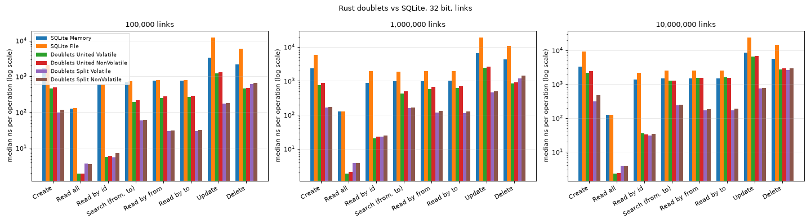
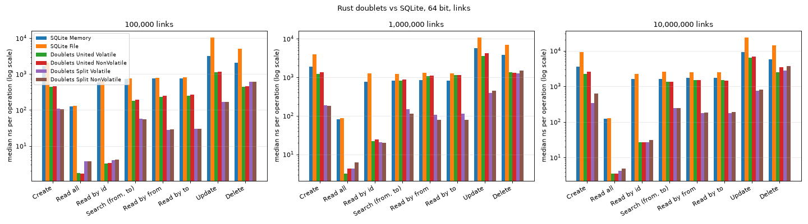
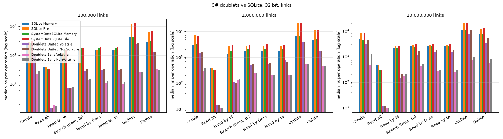
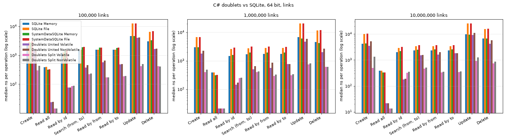
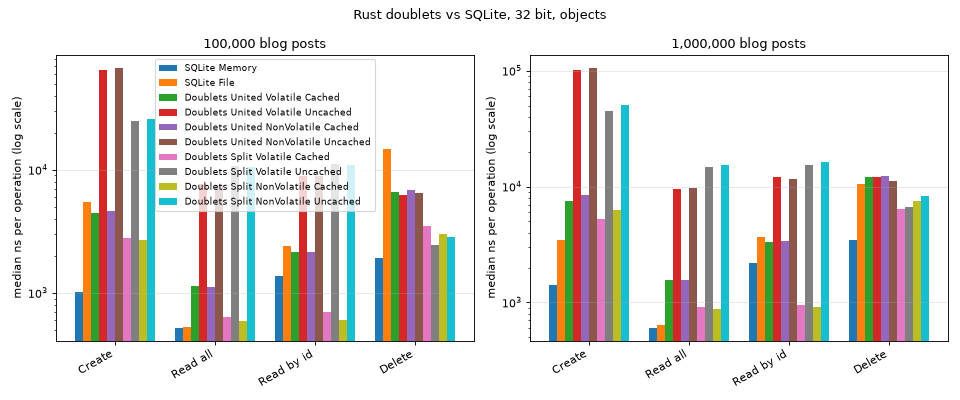
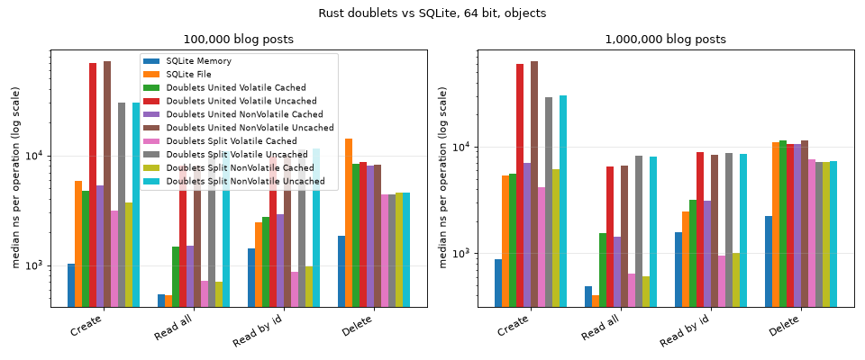
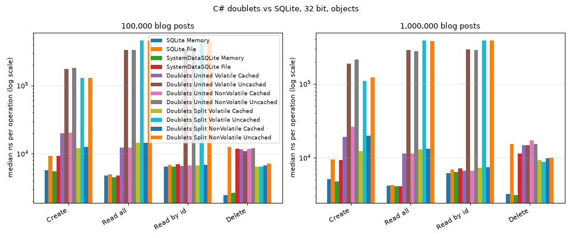
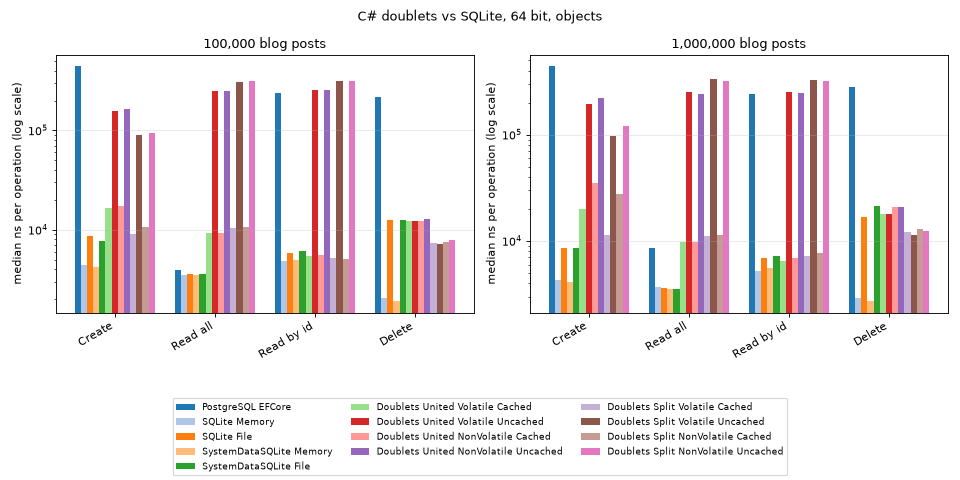

# Comparisons.SQLiteVSDoublets ([русская версия](README.ru.md))

[](https://github.com/linksplatform/Comparisons.SQLiteVSDoublets/actions/workflows/rust.yml)
[](https://github.com/linksplatform/Comparisons.SQLiteVSDoublets/actions/workflows/csharp.yml)
[](https://github.com/linksplatform/Comparisons.SQLiteVSDoublets/actions/workflows/benchmarks.yml)


Comparison of SQLite and LinksPlatform's Doublets (links) on basic embedded
database operations with links and object-like structures.

Based on examples from <https://github.com/FahaoTang/dotnetcore-examples> and
<https://github.com/Konard/LinksPlatform>

## Benchmarks

Rust ([doublets](https://crates.io/crates/doublets) and
[rusqlite](https://crates.io/crates/rusqlite) with bundled SQLite) and C#
([Platform.Data.Doublets](https://www.nuget.org/packages/Platform.Data.Doublets),
[Platform.Data.Doublets.Sequences](https://www.nuget.org/packages/Platform.Data.Doublets.Sequences)
and the providers [Microsoft.Data.Sqlite](https://www.nuget.org/packages/Microsoft.Data.Sqlite)
and [System.Data.SQLite](https://www.nuget.org/packages/System.Data.SQLite))
run the same workloads on the same deterministic data, with 32 bit
(`u32`/`uint`) and 64 bit (`u64`/`ulong`) ids:

- **Links**: SQLite stores the table
  `links(id INTEGER PRIMARY KEY, "from", "to")` with the indices
  `("from", "to")` and `("to", "from")`; Doublets stores the links themselves.
  The operations are create, read all, read by id, search by `(from, to)`,
  read by `from`, read by `to`, update (swap `from` and `to`) and delete.
- **Objects**: blog posts with a title, content and publication date. SQLite
  stores the table `blog_posts(id, title, content, publication_date)`;
  Doublets stores every post as links, with strings as sequences of Unicode
  symbols, like
  [Platform.Data.Doublets.Sequences](https://github.com/linksplatform/Data.Doublets.Sequences)
  does. The operations are create, read all, read by id and delete. Every
  Doublets store runs with and without a cache of the string sequences
  (`Cached`/`Uncached`).

Storages: SQLite in memory and in a file; Doublets united (one array of links
with index trees) and split (separate data and index arrays), each volatile
(in memory) and non-volatile (in memory-mapped files). Doublets are compared
with SQLite of the same durability: volatile with `SQLite Memory`,
non-volatile with `SQLite File`.

C# also runs `SystemDataSQLite_Memory` and `SystemDataSQLite_File` with
System.Data.SQLite 2.0.4. `SQLite_Memory` and `SQLite_File` use
Microsoft.Data.Sqlite. Both providers use the same schemas, parameterized
commands, immediate transactions and native `e_sqlite3` library supplied by
Microsoft.Data.Sqlite, on Linux, macOS and Windows. The JSON reports record
each provider and engine version in `sqlite_providers`. The System.Data.SQLite
rows compare with Microsoft.Data.Sqlite of the same durability. Published
tables from older runs include only the providers measured in those runs;
the next Benchmarks run adds the new rows.

Every repetition runs on a fresh store in an empty directory, after discarded
warm-up repetitions on up to 10,000 records that run for at least a second, so
the .NET JIT has already optimized the code. Each operation is one
timed transaction over all records, point operations visit the records in a
scattered order, and each result is checked against the expected count and
order-sensitive checksum, so a storage that loses, duplicates or mixes up
records fails the run instead of being reported as fast. Repetitions are
`3,000,000 / size` for links and `500,000 / size` for objects, clamped to
`1..=10`. The tables show the median time per operation; a difference is
reported only if the interquartile ranges (the middle half) of the
repetitions do not overlap and the medians differ by more than 5%, otherwise
it is `≈ same`. The file size is measured after creation; Doublets files are
preallocated memory-mapped files, so small stores show the preallocation size.

Every table is measured by its own GitHub Actions job, with all variants on
the same runner, so that a difference is never a difference between machines,
by the [Benchmarks workflow](.github/workflows/benchmarks.yml): links with
100,000, 1,000,000 and 10,000,000 records and objects with 100,000 and
1,000,000 records. These are the largest sizes that fit into the 6 hour limit
of a job: one SQLite File repetition on 100,000,000 links did not finish in
4.5 hours
([run 37228604862](https://github.com/linksplatform/Comparisons.SQLiteVSDoublets/actions/runs/37228604862)),
and 1,000,000 blog posts already take an hour in C#. Pull requests check the
whole pipeline on 1,000 records, and pushes to `main` update the results below.
The workflow can also be started manually with other sizes.

Run locally:

```bash
mkdir -p results
cargo run --release --manifest-path rust/Cargo.toml -- \
  links 64 100000 --output results/links-rust-64-100000.json
dotnet run -c Release --project csharp/SQLiteVSDoublets -- \
  objects 32 1000 --variants SQLite_File,Doublets_Split_NonVolatile_Cached
dotnet run -c Release --project csharp/SQLiteVSDoublets -- \
  links 64 1000 --repetitions 3 \
  --variants SQLite_Memory,SystemDataSQLite_Memory \
  --output results/links-csharp-64-1000.json
# print the tables, add --readme README.md --charts docs/benchmarks to update
python3 scripts/benchmark_report.py results
```

Notes:

- The split stores of doublets 0.5.0 (Rust) lose a link that is updated to
  reference itself, so the benchmark updates a link to `(0, 0)` first, which
  is the state links are created in
  ([experiments/split_store_delete](experiments/split_store_delete)).
- The stores of doublets 0.5.0 (Rust) take the part of the memory that
  `platform-mem` 0.3.0 returns after growing it for the whole memory, so a
  store fails after 1,040,384 links; the benchmarks wrap the memory in
  [`memory::Whole`](rust/src/memory.rs), which returns the whole memory
  ([experiments/unit_store_growth](experiments/unit_store_growth)).
- In C#, links are deleted with `Delete(id, handler: null)`, which resets the
  link before deleting it; the bare `Delete(id)` leaves the link in the index
  trees, and later searches fail
  ([experiments/csharp_tree_delete](experiments/csharp_tree_delete)).
- The C# united stores use AVL index trees: the default size balanced trees
  degenerate when many links share a source or a target, which makes each
  blog post creation linear in the number of posts
  ([experiments/csharp_objects_profile](experiments/csharp_objects_profile)).
- The C# split stores keep the default linked list of the internal sources,
  which doublets 0.5.0 (Rust) does not have; it makes the C# updates faster
  and the other operations take about the same time
  ([experiments/csharp_split_linked_list](experiments/csharp_split_linked_list)).
- Objects stores use external references for numbers and Unicode symbols, so
  raw values never collide with link ids.
- Reading a string without the cache walks its sequence link by link; in C#
  each `GetSource`/`GetTarget` call of `Platform.Data` allocates a handler and
  a list, which makes the uncached C# reads much slower than the Rust ones.

<!--BENCHMARK_RESULTS_START-->
<!-- markdownlint-disable MD013 MD024 -->
## Doublets vs SQLite as storage for links

### Rust doublets vs SQLite

#### 32 bit address/id space benchmarks

##### 100,000 links

_10 repetitions after a warm-up, median time per operation. SQLite 3.53.2, Ubuntu 24.04.5 LTS, AMD EPYC 9V45 96-Core Processor, 4 cores, 16 GiB, [GitHub Actions run](https://github.com/linksplatform/Comparisons.SQLiteVSDoublets/actions/runs/37293771868) on 2026-10-05._

| Storage | Create | Read all | Read by id | Search (from, to) | Read by from | Read by to | Update | Delete | File size |
| --- | ---: | ---: | ---: | ---: | ---: | ---: | ---: | ---: | ---: |
| SQLite Memory | 1.04 µs | 65.7 ns | 373 ns | 419 ns | 446 ns | 451 ns | 2.01 µs | 1.3 µs | — |
| SQLite File | 1.34 µs | 68.6 ns | 379 ns | 435 ns | 464 ns | 459 ns | 7.6 µs | 3.77 µs | 4.4 MiB |
| Doublets United Volatile | 299 ns (3.47× faster) | 1.18 ns (55.8× faster) | 2.57 ns (145× faster) | 121 ns (3.45× faster) | 140 ns (3.19× faster) | 151 ns (2.98× faster) | 753 ns (2.67× faster) | 290 ns (4.48× faster) | — |
| Doublets United NonVolatile | 293 ns (4.57× faster) | 1.17 ns (58.4× faster) | 2.38 ns (159× faster) | 129 ns (3.37× faster) | 147 ns (3.16× faster) | 153 ns (3.01× faster) | 752 ns (10.1× faster) | 283 ns (13.3× faster) | 32.0 MiB |
| Doublets Split Volatile | 58.9 ns (17.6× faster) | 2.34 ns (28.1× faster) | 2.42 ns (154× faster) | 35.9 ns (11.7× faster) | 17.8 ns (25.1× faster) | 17.9 ns (25.2× faster) | 106 ns (18.9× faster) | 358 ns (3.63× faster) | — |
| Doublets Split NonVolatile | 56.7 ns (23.6× faster) | 2.25 ns (30.5× faster) | 2.27 ns (167× faster) | 36.5 ns (11.9× faster) | 18 ns (25.8× faster) | 18.2 ns (25.3× faster) | 110 ns (69.2× faster) | 373 ns (10.1× faster) | 40.0 MiB |

##### 1,000,000 links

_3 repetitions after a warm-up, median time per operation. SQLite 3.53.2, Ubuntu 24.04.5 LTS, AMD EPYC 9V45 96-Core Processor, 4 cores, 16 GiB, [GitHub Actions run](https://github.com/linksplatform/Comparisons.SQLiteVSDoublets/actions/runs/37293771868) on 2026-10-05._

| Storage | Create | Read all | Read by id | Search (from, to) | Read by from | Read by to | Update | Delete | File size |
| --- | ---: | ---: | ---: | ---: | ---: | ---: | ---: | ---: | ---: |
| SQLite Memory | 1.9 µs | 67.7 ns | 856 ns | 784 ns | 864 ns | 776 ns | 6.57 µs | 4.48 µs | — |
| SQLite File | 4.27 µs | 70.1 ns | 1.44 µs | 1.39 µs | 1.35 µs | 1.33 µs | 13.7 µs | 7.8 µs | 48.2 MiB |
| Doublets United Volatile | 902 ns (2.11× faster) | 1.25 ns (53.9× faster) | 23.3 ns (36.8× faster) | 581 ns (1.35× faster) | 837 ns (≈ same) | 893 ns (1.15× slower) | 3.42 µs (1.92× faster) | 1.11 µs (4.03× faster) | — |
| Doublets United NonVolatile | 1.03 µs (4.15× faster) | 1.27 ns (55.3× faster) | 23.5 ns (61.2× faster) | 763 ns (1.82× faster) | 983 ns (1.37× faster) | 956 ns (1.39× faster) | 3.4 µs (4.03× faster) | 1.1 µs (7.1× faster) | 32.0 MiB |
| Doublets Split Volatile | 231 ns (8.24× faster) | 2.37 ns (28.6× faster) | 22.2 ns (38.5× faster) | 190 ns (4.14× faster) | 115 ns (7.51× faster) | 120 ns (6.47× faster) | 488 ns (13.5× faster) | 1.41 µs (3.18× faster) | — |
| Doublets Split NonVolatile | 238 ns (17.9× faster) | 2.39 ns (29.3× faster) | 22.6 ns (63.8× faster) | 198 ns (6.99× faster) | 115 ns (11.7× faster) | 122 ns (10.9× faster) | 473 ns (29× faster) | 1.32 µs (5.93× faster) | 40.0 MiB |

##### 10,000,000 links

_1 repetition after a warm-up, median time per operation. SQLite 3.53.2, Ubuntu 24.04.5 LTS, Intel(R) Xeon(R) Platinum 8370C CPU @ 2.80GHz, 4 cores, 16 GiB, [GitHub Actions run](https://github.com/linksplatform/Comparisons.SQLiteVSDoublets/actions/runs/37293771868) on 2026-10-05._

| Storage | Create | Read all | Read by id | Search (from, to) | Read by from | Read by to | Update | Delete | File size |
| --- | ---: | ---: | ---: | ---: | ---: | ---: | ---: | ---: | ---: |
| SQLite Memory | 3.88 µs | 103 ns | 1.52 µs | 1.61 µs | 1.65 µs | 1.64 µs | 9.22 µs | 6.12 µs | — |
| SQLite File | 7.52 µs | 109 ns | 2.03 µs | 2.27 µs | 2.22 µs | 2.22 µs | 18.6 µs | 11.3 µs | 501.0 MiB |
| Doublets United Volatile | 2.11 µs (1.84× faster) | 3.35 ns (30.8× faster) | 30.9 ns (49.1× faster) | 1.49 µs (1.08× faster) | 1.75 µs (1.06× slower) | 1.83 µs (1.12× slower) | 7.42 µs (1.24× faster) | 3.22 µs (1.9× faster) | — |
| Doublets United NonVolatile | 2.84 µs (2.65× faster) | 3.59 ns (30.5× faster) | 30.5 ns (66.4× faster) | 1.58 µs (1.43× faster) | 1.82 µs (1.22× faster) | 1.82 µs (1.22× faster) | 8.17 µs (2.28× faster) | 3.68 µs (3.06× faster) | 320.0 MiB |
| Doublets Split Volatile | 340 ns (11.4× faster) | 4.28 ns (24.1× faster) | 30.7 ns (49.4× faster) | 217 ns (7.43× faster) | 159 ns (10.4× faster) | 154 ns (10.7× faster) | 663 ns (13.9× faster) | 3.2 µs (1.91× faster) | — |
| Doublets Split NonVolatile | 476 ns (15.8× faster) | 4.11 ns (26.6× faster) | 39.4 ns (51.5× faster) | 235 ns (9.67× faster) | 162 ns (13.7× faster) | 166 ns (13.4× faster) | 702 ns (26.6× faster) | 3.95 µs (2.85× faster) | 400.0 MiB |



#### 64 bit address/id space benchmarks

##### 100,000 links

_10 repetitions after a warm-up, median time per operation. SQLite 3.53.2, Ubuntu 24.04.5 LTS, INTEL(R) XEON(R) PLATINUM 8573C, 4 cores, 16 GiB, [GitHub Actions run](https://github.com/linksplatform/Comparisons.SQLiteVSDoublets/actions/runs/37293771868) on 2026-10-05._

| Storage | Create | Read all | Read by id | Search (from, to) | Read by from | Read by to | Update | Delete | File size |
| --- | ---: | ---: | ---: | ---: | ---: | ---: | ---: | ---: | ---: |
| SQLite Memory | 1.54 µs | 110 ns | 528 ns | 618 ns | 655 ns | 656 ns | 3.08 µs | 2.08 µs | — |
| SQLite File | 1.94 µs | 116 ns | 545 ns | 653 ns | 682 ns | 692 ns | 8 µs | 4.35 µs | 4.4 MiB |
| Doublets United Volatile | 492 ns (3.13× faster) | 2.63 ns (41.9× faster) | 6.11 ns (86.5× faster) | 208 ns (2.97× faster) | 250 ns (2.62× faster) | 268 ns (2.45× faster) | 1.38 µs (2.23× faster) | 520 ns (4× faster) | — |
| Doublets United NonVolatile | 527 ns (3.69× faster) | 3.03 ns (38.4× faster) | 6.55 ns (83.2× faster) | 242 ns (2.69× faster) | 272 ns (2.51× faster) | 273 ns (2.54× faster) | 1.44 µs (5.57× faster) | 527 ns (8.26× faster) | 64.0 MiB |
| Doublets Split Volatile | 101 ns (15.2× faster) | 3.37 ns (32.8× faster) | 6.35 ns (83.2× faster) | 68.5 ns (9.03× faster) | 40.3 ns (16.3× faster) | 40.2 ns (16.3× faster) | 208 ns (14.8× faster) | 672 ns (3.1× faster) | — |
| Doublets Split NonVolatile | 108 ns (18× faster) | 3.79 ns (30.7× faster) | 7.23 ns (75.3× faster) | 70.3 ns (9.29× faster) | 43.2 ns (15.8× faster) | 41.7 ns (16.6× faster) | 209 ns (38.2× faster) | 706 ns (6.16× faster) | 80.0 MiB |

##### 1,000,000 links

_3 repetitions after a warm-up, median time per operation. SQLite 3.53.2, Ubuntu 24.04.5 LTS, AMD EPYC 7763 64-Core Processor, 4 cores, 16 GiB, [GitHub Actions run](https://github.com/linksplatform/Comparisons.SQLiteVSDoublets/actions/runs/37293771868) on 2026-10-05._

| Storage | Create | Read all | Read by id | Search (from, to) | Read by from | Read by to | Update | Delete | File size |
| --- | ---: | ---: | ---: | ---: | ---: | ---: | ---: | ---: | ---: |
| SQLite Memory | 2.34 µs | 126 ns | 802 ns | 928 ns | 989 ns | 978 ns | 6.09 µs | 4.02 µs | — |
| SQLite File | 5.88 µs | 131 ns | 1.96 µs | 1.9 µs | 1.99 µs | 1.93 µs | 19.2 µs | 10.7 µs | 48.2 MiB |
| Doublets United Volatile | 1.38 µs (1.7× faster) | 3.31 ns (38× faster) | 22.6 ns (35.5× faster) | 761 ns (1.22× faster) | 931 ns (1.06× faster) | 1.02 µs (≈ same) | 4.09 µs (1.49× faster) | 1.54 µs (2.61× faster) | — |
| Doublets United NonVolatile | 1.63 µs (3.6× faster) | 3.75 ns (34.9× faster) | 25.3 ns (77.2× faster) | 978 ns (1.95× faster) | 1.19 µs (1.67× faster) | 1.24 µs (1.56× faster) | 4.74 µs (4.05× faster) | 1.76 µs (6.1× faster) | 64.0 MiB |
| Doublets Split Volatile | 306 ns (7.63× faster) | 4.33 ns (29× faster) | 23.2 ns (34.6× faster) | 224 ns (4.15× faster) | 159 ns (6.23× faster) | 159 ns (6.15× faster) | 639 ns (9.53× faster) | 1.85 µs (2.18× faster) | — |
| Doublets Split NonVolatile | 323 ns (18.2× faster) | 4.75 ns (27.6× faster) | 26.9 ns (72.8× faster) | 230 ns (8.26× faster) | 173 ns (11.5× faster) | 173 ns (11.2× faster) | 723 ns (26.6× faster) | 2.07 µs (5.17× faster) | 80.0 MiB |

##### 10,000,000 links

_1 repetition after a warm-up, median time per operation. SQLite 3.53.2, Ubuntu 24.04.5 LTS, INTEL(R) XEON(R) PLATINUM 8573C, 4 cores, 16 GiB, [GitHub Actions run](https://github.com/linksplatform/Comparisons.SQLiteVSDoublets/actions/runs/37293771868) on 2026-10-05._

| Storage | Create | Read all | Read by id | Search (from, to) | Read by from | Read by to | Update | Delete | File size |
| --- | ---: | ---: | ---: | ---: | ---: | ---: | ---: | ---: | ---: |
| SQLite Memory | 4.47 µs | 110 ns | 1.86 µs | 2.01 µs | 1.95 µs | 1.94 µs | 11.2 µs | 7.68 µs | — |
| SQLite File | 7.79 µs | 117 ns | 2.12 µs | 2.25 µs | 2.3 µs | 2.25 µs | 19.8 µs | 11.7 µs | 501.0 MiB |
| Doublets United Volatile | 3.46 µs (1.29× faster) | 7.25 ns (15.1× faster) | 24 ns (77.6× faster) | 1.75 µs (1.15× faster) | 2.02 µs (≈ same) | 2.46 µs (1.26× slower) | 8.9 µs (1.26× faster) | 3.77 µs (2.04× faster) | — |
| Doublets United NonVolatile | 4.38 µs (1.78× faster) | 7.58 ns (15.4× faster) | 29.2 ns (72.5× faster) | 2.07 µs (1.09× faster) | 2.28 µs (≈ same) | 2.36 µs (≈ same) | 11.3 µs (1.75× faster) | 4.87 µs (2.41× faster) | 640.0 MiB |
| Doublets Split Volatile | 433 ns (10.3× faster) | 9.36 ns (11.7× faster) | 28 ns (66.4× faster) | 259 ns (7.76× faster) | 145 ns (13.4× faster) | 146 ns (13.3× faster) | 740 ns (15.1× faster) | 3.73 µs (2.06× faster) | — |
| Doublets Split NonVolatile | 831 ns (9.38× faster) | 8.44 ns (13.8× faster) | 30.8 ns (68.7× faster) | 271 ns (8.32× faster) | 162 ns (14.2× faster) | 169 ns (13.3× faster) | 805 ns (24.6× faster) | 4.59 µs (2.55× faster) | 800.0 MiB |



### C# doublets vs SQLite

#### 32 bit address/id space benchmarks

##### 100,000 links

_10 repetitions after a warm-up, median time per operation. SQLite 3.53.3, Ubuntu 24.04.5 LTS, AMD EPYC 7763 64-Core Processor, 4 cores, 16 GiB, [GitHub Actions run](https://github.com/linksplatform/Comparisons.SQLiteVSDoublets/actions/runs/37293771868) on 2026-10-05._

| Storage | Create | Read all | Read by id | Search (from, to) | Read by from | Read by to | Update | Delete | File size |
| --- | ---: | ---: | ---: | ---: | ---: | ---: | ---: | ---: | ---: |
| SQLite Memory | 2.47 µs | 379 ns | 1.18 µs | 1.47 µs | 1.52 µs | 1.5 µs | 4.28 µs | 2.87 µs | — |
| SQLite File | 2.84 µs | 387 ns | 1.2 µs | 1.49 µs | 1.55 µs | 1.54 µs | 12.4 µs | 6.41 µs | 4.4 MiB |
| Doublets United Volatile | 1.04 µs (2.37× faster) | 15.5 ns (24.4× faster) | 67.3 ns (17.5× faster) | 243 ns (6.05× faster) | 275 ns (5.52× faster) | 282 ns (5.31× faster) | 2.19 µs (1.96× faster) | 1.16 µs (2.46× faster) | — |
| Doublets United NonVolatile | 1.08 µs (2.63× faster) | 15.5 ns (24.9× faster) | 63.8 ns (18.9× faster) | 264 ns (5.64× faster) | 382 ns (4.05× faster) | 272 ns (5.68× faster) | 2.19 µs (5.65× faster) | 1.11 µs (5.78× faster) | 32.0 MiB |
| Doublets Split Volatile | 198 ns (12.5× faster) | 16.3 ns (23.2× faster) | 68.8 ns (17.1× faster) | 116 ns (12.7× faster) | 99.1 ns (15.3× faster) | 86.9 ns (17.2× faster) | 228 ns (18.8× faster) | 290 ns (9.89× faster) | — |
| Doublets Split NonVolatile | 257 ns (11.1× faster) | 16.7 ns (23.1× faster) | 68.9 ns (17.5× faster) | 122 ns (12.2× faster) | 93.7 ns (16.5× faster) | 91.5 ns (16.8× faster) | 235 ns (52.6× faster) | 265 ns (24.2× faster) | 40.0 MiB |

##### 1,000,000 links

_3 repetitions after a warm-up, median time per operation. SQLite 3.53.3, Ubuntu 24.04.5 LTS, AMD EPYC 9V45 96-Core Processor, 4 cores, 16 GiB, [GitHub Actions run](https://github.com/linksplatform/Comparisons.SQLiteVSDoublets/actions/runs/37293771868) on 2026-10-05._

| Storage | Create | Read all | Read by id | Search (from, to) | Read by from | Read by to | Update | Delete | File size |
| --- | ---: | ---: | ---: | ---: | ---: | ---: | ---: | ---: | ---: |
| SQLite Memory | 2.05 µs | 313 ns | 1.01 µs | 1.15 µs | 1.18 µs | 1.16 µs | 5.52 µs | 3.72 µs | — |
| SQLite File | 4.83 µs | 315 ns | 1.83 µs | 1.83 µs | 1.9 µs | 1.89 µs | 14.8 µs | 8.63 µs | 48.2 MiB |
| Doublets United Volatile | 1.32 µs (1.56× faster) | 8.41 ns (37.2× faster) | 149 ns (6.8× faster) | 621 ns (1.86× faster) | 824 ns (1.43× faster) | 783 ns (1.49× faster) | 4.43 µs (1.25× faster) | 1.81 µs (2.06× faster) | — |
| Doublets United NonVolatile | 1.67 µs (2.88× faster) | 8.31 ns (38× faster) | 133 ns (13.8× faster) | 667 ns (2.74× faster) | 883 ns (2.15× faster) | 744 ns (2.54× faster) | 4.93 µs (3.01× faster) | 2.02 µs (4.26× faster) | 32.0 MiB |
| Doublets Split Volatile | 302 ns (6.8× faster) | 7.07 ns (44.3× faster) | 163 ns (6.21× faster) | 391 ns (2.95× faster) | 308 ns (3.83× faster) | 297 ns (3.92× faster) | 576 ns (9.57× faster) | 484 ns (7.68× faster) | — |
| Doublets Split NonVolatile | 360 ns (13.4× faster) | 7.07 ns (44.6× faster) | 162 ns (11.3× faster) | 379 ns (4.83× faster) | 310 ns (6.12× faster) | 302 ns (6.26× faster) | 582 ns (25.5× faster) | 490 ns (17.6× faster) | 40.0 MiB |

##### 10,000,000 links

_1 repetition after a warm-up, median time per operation. SQLite 3.53.3, Ubuntu 24.04.5 LTS, AMD EPYC 9V74 80-Core Processor, 4 cores, 16 GiB, [GitHub Actions run](https://github.com/linksplatform/Comparisons.SQLiteVSDoublets/actions/runs/37293771868) on 2026-10-05._

| Storage | Create | Read all | Read by id | Search (from, to) | Read by from | Read by to | Update | Delete | File size |
| --- | ---: | ---: | ---: | ---: | ---: | ---: | ---: | ---: | ---: |
| SQLite Memory | 4.26 µs | 311 ns | 2.02 µs | 2.2 µs | 2.12 µs | 2.11 µs | 9.69 µs | 6.89 µs | — |
| SQLite File | 9.68 µs | 315 ns | 2.74 µs | 3.3 µs | 3.19 µs | 3.18 µs | 26 µs | 15.5 µs | 501.0 MiB |
| Doublets United Volatile | 3.36 µs (1.27× faster) | 11.9 ns (26.2× faster) | 164 ns (12.3× faster) | 1.39 µs (1.58× faster) | 1.61 µs (1.32× faster) | 1.46 µs (1.45× faster) | 7.94 µs (1.22× faster) | 3.77 µs (1.83× faster) | — |
| Doublets United NonVolatile | 4.98 µs (1.95× faster) | 11.6 ns (27.1× faster) | 192 ns (14.3× faster) | 1.9 µs (1.74× faster) | 2.2 µs (1.45× faster) | 1.95 µs (1.63× faster) | 9.83 µs (2.64× faster) | 4.65 µs (3.34× faster) | 320.0 MiB |
| Doublets Split Volatile | 416 ns (10.2× faster) | 11.3 ns (27.5× faster) | 187 ns (10.8× faster) | 452 ns (4.86× faster) | 315 ns (6.73× faster) | 315 ns (6.71× faster) | 788 ns (12.3× faster) | 576 ns (12× faster) | — |
| Doublets Split NonVolatile | 1.2 µs (8.08× faster) | 11.2 ns (28× faster) | 210 ns (13× faster) | 513 ns (6.44× faster) | 358 ns (8.91× faster) | 355 ns (8.96× faster) | 1.07 µs (24.4× faster) | 847 ns (18.3× faster) | 400.0 MiB |



#### 64 bit address/id space benchmarks

##### 100,000 links

_10 repetitions after a warm-up, median time per operation. SQLite 3.53.3, Ubuntu 24.04.5 LTS, Intel(R) Xeon(R) 6973P-C, 4 cores, 16 GiB, [GitHub Actions run](https://github.com/linksplatform/Comparisons.SQLiteVSDoublets/actions/runs/37293771868) on 2026-10-05._

| Storage | Create | Read all | Read by id | Search (from, to) | Read by from | Read by to | Update | Delete | File size |
| --- | ---: | ---: | ---: | ---: | ---: | ---: | ---: | ---: | ---: |
| SQLite Memory | 1.63 µs | 323 ns | 821 ns | 1.01 µs | 1.06 µs | 1.07 µs | 3.2 µs | 2.15 µs | — |
| SQLite File | 2 µs | 358 ns | 915 ns | 1.09 µs | 1.14 µs | 1.17 µs | 7.53 µs | 4.17 µs | 4.4 MiB |
| Doublets United Volatile | 1.23 µs (1.33× faster) | 20 ns (16.2× faster) | 83.6 ns (9.81× faster) | 250 ns (4.04× faster) | 292 ns (3.61× faster) | 319 ns (3.36× faster) | 2.59 µs (1.23× faster) | 1.28 µs (1.67× faster) | — |
| Doublets United NonVolatile | 1.26 µs (1.59× faster) | 20.2 ns (17.8× faster) | 70.5 ns (13× faster) | 291 ns (3.75× faster) | 387 ns (2.95× faster) | 309 ns (3.8× faster) | 2.66 µs (2.83× faster) | 1.28 µs (3.24× faster) | 64.0 MiB |
| Doublets Split Volatile | 231 ns (7.06× faster) | 21.4 ns (15.1× faster) | 88.6 ns (9.26× faster) | 130 ns (7.76× faster) | 119 ns (8.84× faster) | 117 ns (9.14× faster) | 231 ns (13.9× faster) | 297 ns (7.23× faster) | — |
| Doublets Split NonVolatile | 286 ns (6.99× faster) | 20.5 ns (17.5× faster) | 91 ns (10.1× faster) | 139 ns (7.84× faster) | 128 ns (8.89× faster) | 123 ns (9.53× faster) | 243 ns (31× faster) | 271 ns (15.4× faster) | 80.0 MiB |

##### 1,000,000 links

_3 repetitions after a warm-up, median time per operation. SQLite 3.53.3, Ubuntu 24.04.5 LTS, AMD EPYC 7763 64-Core Processor, 4 cores, 16 GiB, [GitHub Actions run](https://github.com/linksplatform/Comparisons.SQLiteVSDoublets/actions/runs/37293771868) on 2026-10-05._

| Storage | Create | Read all | Read by id | Search (from, to) | Read by from | Read by to | Update | Delete | File size |
| --- | ---: | ---: | ---: | ---: | ---: | ---: | ---: | ---: | ---: |
| SQLite Memory | 3.23 µs | 380 ns | 1.68 µs | 1.89 µs | 1.98 µs | 1.88 µs | 7.78 µs | 5.42 µs | — |
| SQLite File | 6.7 µs | 382 ns | 2.67 µs | 2.7 µs | 2.77 µs | 2.79 µs | 20.6 µs | 11.7 µs | 48.2 MiB |
| Doublets United Volatile | 2.07 µs (1.56× faster) | 21.5 ns (17.7× faster) | 157 ns (10.7× faster) | 625 ns (3.03× faster) | 966 ns (2.05× faster) | 758 ns (2.49× faster) | 5.22 µs (1.49× faster) | 2.32 µs (2.33× faster) | — |
| Doublets United NonVolatile | 2.28 µs (2.94× faster) | 21.8 ns (17.5× faster) | 176 ns (15.1× faster) | 760 ns (3.56× faster) | 975 ns (2.84× faster) | 786 ns (3.54× faster) | 5.33 µs (3.86× faster) | 2.55 µs (4.59× faster) | 64.0 MiB |
| Doublets Split Volatile | 381 ns (8.49× faster) | 13.3 ns (28.7× faster) | 220 ns (7.65× faster) | 344 ns (5.5× faster) | 262 ns (7.57× faster) | 276 ns (6.82× faster) | 667 ns (11.7× faster) | 559 ns (9.69× faster) | — |
| Doublets Split NonVolatile | 472 ns (14.2× faster) | 13.7 ns (27.9× faster) | 233 ns (11.5× faster) | 364 ns (7.42× faster) | 291 ns (9.52× faster) | 297 ns (9.38× faster) | 709 ns (29× faster) | 566 ns (20.6× faster) | 80.0 MiB |

##### 10,000,000 links

_1 repetition after a warm-up, median time per operation. SQLite 3.53.3, Ubuntu 24.04.5 LTS, AMD EPYC 9V74 80-Core Processor, 4 cores, 16 GiB, [GitHub Actions run](https://github.com/linksplatform/Comparisons.SQLiteVSDoublets/actions/runs/37293771868) on 2026-10-05._

| Storage | Create | Read all | Read by id | Search (from, to) | Read by from | Read by to | Update | Delete | File size |
| --- | ---: | ---: | ---: | ---: | ---: | ---: | ---: | ---: | ---: |
| SQLite Memory | 4.28 µs | 327 ns | 2.03 µs | 2.19 µs | 2.25 µs | 2.27 µs | 10.1 µs | 6.93 µs | — |
| SQLite File | 10.2 µs | 322 ns | 2.76 µs | 3.26 µs | 3.2 µs | 3.15 µs | 25 µs | 15.3 µs | 501.0 MiB |
| Doublets United Volatile | 3.68 µs (1.16× faster) | 18.1 ns (18.1× faster) | 175 ns (11.6× faster) | 1.34 µs (1.64× faster) | 1.61 µs (1.4× faster) | 1.87 µs (1.21× faster) | 9.07 µs (1.12× faster) | 4.07 µs (1.7× faster) | — |
| Doublets United NonVolatile | 6.39 µs (1.59× faster) | 17.9 ns (18× faster) | 189 ns (14.6× faster) | 2.06 µs (1.58× faster) | 2.53 µs (1.26× faster) | 2.35 µs (1.34× faster) | 13.5 µs (1.85× faster) | 6.32 µs (2.42× faster) | 640.0 MiB |
| Doublets Split Volatile | 505 ns (8.49× faster) | 18.1 ns (18.1× faster) | 240 ns (8.45× faster) | 572 ns (3.83× faster) | 369 ns (6.1× faster) | 379 ns (6× faster) | 927 ns (10.9× faster) | 659 ns (10.5× faster) | — |
| Doublets Split NonVolatile | 2.04 µs (4.99× faster) | 18.2 ns (17.7× faster) | 233 ns (11.8× faster) | 598 ns (5.46× faster) | 410 ns (7.8× faster) | 426 ns (7.39× faster) | 1.03 µs (24.4× faster) | 661 ns (23.1× faster) | 800.0 MiB |



## Doublets vs SQLite as storage for objects

### Rust doublets vs SQLite

#### 32 bit address/id space benchmarks

##### 100,000 blog posts

_5 repetitions after a warm-up, median time per operation. SQLite 3.53.2, Ubuntu 24.04.5 LTS, AMD EPYC 9V74 80-Core Processor, 4 cores, 16 GiB, [GitHub Actions run](https://github.com/linksplatform/Comparisons.SQLiteVSDoublets/actions/runs/37293771868) on 2026-10-05._

| Storage | Create | Read all | Read by id | Delete | File size |
| --- | ---: | ---: | ---: | ---: | ---: |
| SQLite Memory | 1.02 µs | 523 ns | 1.37 µs | 1.91 µs | — |
| SQLite File | 5.51 µs | 529 ns | 2.4 µs | 14.9 µs | 78.3 MiB |
| Doublets United Volatile Cached | 4.44 µs (4.35× slower) | 1.14 µs (2.17× slower) | 2.16 µs (1.58× slower) | 6.6 µs (3.46× slower) | — |
| Doublets United Volatile Uncached | 65.4 µs (64.1× slower) | 7.63 µs (14.6× slower) | 8.95 µs (6.55× slower) | 6.29 µs (3.3× slower) | — |
| Doublets United NonVolatile Cached | 4.6 µs (1.2× faster) | 1.12 µs (2.12× slower) | 2.13 µs (1.12× faster) | 6.84 µs (2.18× faster) | 32.0 MiB |
| Doublets United NonVolatile Uncached | 67.7 µs (12.3× slower) | 7.5 µs (14.2× slower) | 8.92 µs (3.72× slower) | 6.46 µs (2.31× faster) | 32.0 MiB |
| Doublets Split Volatile Cached | 2.81 µs (2.76× slower) | 634 ns (1.21× slower) | 699 ns (1.95× faster) | 3.49 µs (1.83× slower) | — |
| Doublets Split Volatile Uncached | 25.1 µs (24.6× slower) | 10.7 µs (20.5× slower) | 11.1 µs (8.15× slower) | 2.44 µs (1.28× slower) | — |
| Doublets Split NonVolatile Cached | 2.71 µs (2.03× faster) | 595 ns (1.13× slower) | 603 ns (3.98× faster) | 2.99 µs (4.98× faster) | 40.0 MiB |
| Doublets Split NonVolatile Uncached | 26 µs (4.71× slower) | 10.6 µs (20× slower) | 11.1 µs (4.61× slower) | 2.86 µs (5.21× faster) | 40.0 MiB |

##### 1,000,000 blog posts

_1 repetition after a warm-up, median time per operation. SQLite 3.53.2, Ubuntu 24.04.5 LTS, AMD EPYC 7763 64-Core Processor, 4 cores, 16 GiB, [GitHub Actions run](https://github.com/linksplatform/Comparisons.SQLiteVSDoublets/actions/runs/37293771868) on 2026-10-05._

| Storage | Create | Read all | Read by id | Delete | File size |
| --- | ---: | ---: | ---: | ---: | ---: |
| SQLite Memory | 1.4 µs | 608 ns | 2.2 µs | 3.44 µs | — |
| SQLite File | 3.45 µs | 636 ns | 3.69 µs | 10.5 µs | 783.2 MiB |
| Doublets United Volatile Cached | 7.53 µs (5.37× slower) | 1.56 µs (2.57× slower) | 3.31 µs (1.51× slower) | 12.1 µs (3.53× slower) | — |
| Doublets United Volatile Uncached | 102 µs (72.5× slower) | 9.58 µs (15.8× slower) | 12.1 µs (5.52× slower) | 12.2 µs (3.56× slower) | — |
| Doublets United NonVolatile Cached | 8.5 µs (2.47× slower) | 1.57 µs (2.47× slower) | 3.39 µs (1.09× faster) | 12.4 µs (1.18× slower) | 320.0 MiB |
| Doublets United NonVolatile Uncached | 106 µs (30.8× slower) | 9.78 µs (15.4× slower) | 11.6 µs (3.14× slower) | 11.3 µs (1.07× slower) | 320.0 MiB |
| Doublets Split Volatile Cached | 5.27 µs (3.76× slower) | 919 ns (1.51× slower) | 960 ns (2.29× faster) | 6.36 µs (1.85× slower) | — |
| Doublets Split Volatile Uncached | 45.4 µs (32.3× slower) | 14.7 µs (24.1× slower) | 15.3 µs (6.97× slower) | 6.65 µs (1.94× slower) | — |
| Doublets Split NonVolatile Cached | 6.32 µs (1.83× slower) | 878 ns (1.38× slower) | 922 ns (4× faster) | 7.58 µs (1.38× faster) | 400.0 MiB |
| Doublets Split NonVolatile Uncached | 50.9 µs (14.8× slower) | 15.4 µs (24.2× slower) | 16.2 µs (4.38× slower) | 8.35 µs (1.26× faster) | 400.0 MiB |



#### 64 bit address/id space benchmarks

##### 100,000 blog posts

_5 repetitions after a warm-up, median time per operation. SQLite 3.53.2, Ubuntu 24.04.5 LTS, AMD EPYC 9V45 96-Core Processor, 4 cores, 16 GiB, [GitHub Actions run](https://github.com/linksplatform/Comparisons.SQLiteVSDoublets/actions/runs/37293771868) on 2026-10-05._

| Storage | Create | Read all | Read by id | Delete | File size |
| --- | ---: | ---: | ---: | ---: | ---: |
| SQLite Memory | 801 ns | 516 ns | 1.2 µs | 1.48 µs | — |
| SQLite File | 5.53 µs | 429 ns | 1.79 µs | 10.2 µs | 78.3 MiB |
| Doublets United Volatile Cached | 3.59 µs (4.48× slower) | 1.3 µs (2.52× slower) | 2.41 µs (2.02× slower) | 6.82 µs (4.61× slower) | — |
| Doublets United Volatile Uncached | 55.2 µs (68.9× slower) | 6.6 µs (12.8× slower) | 8.02 µs (6.71× slower) | 6.94 µs (4.69× slower) | — |
| Doublets United NonVolatile Cached | 3.69 µs (1.5× faster) | 1.29 µs (3.01× slower) | 2.34 µs (1.31× slower) | 5.39 µs (1.89× faster) | 64.0 MiB |
| Doublets United NonVolatile Uncached | 54.8 µs (9.93× slower) | 6.47 µs (15.1× slower) | 7.83 µs (4.39× slower) | 6.51 µs (1.57× faster) | 64.0 MiB |
| Doublets Split Volatile Cached | 2.46 µs (3.07× slower) | 511 ns (≈ same) | 603 ns (1.98× faster) | 3.76 µs (2.54× slower) | — |
| Doublets Split Volatile Uncached | 28.4 µs (35.4× slower) | 8.02 µs (15.5× slower) | 8.47 µs (7.09× slower) | 3.65 µs (2.47× slower) | — |
| Doublets Split NonVolatile Cached | 2.58 µs (2.14× faster) | 519 ns (1.21× slower) | 582 ns (3.07× faster) | 3.87 µs (2.64× faster) | 80.0 MiB |
| Doublets Split NonVolatile Uncached | 28.4 µs (5.15× slower) | 8.21 µs (19.2× slower) | 8.72 µs (4.89× slower) | 3.69 µs (2.76× faster) | 80.0 MiB |

##### 1,000,000 blog posts

_1 repetition after a warm-up, median time per operation. SQLite 3.53.2, Ubuntu 24.04.5 LTS, AMD EPYC 7763 64-Core Processor, 4 cores, 16 GiB, [GitHub Actions run](https://github.com/linksplatform/Comparisons.SQLiteVSDoublets/actions/runs/37293771868) on 2026-10-05._

| Storage | Create | Read all | Read by id | Delete | File size |
| --- | ---: | ---: | ---: | ---: | ---: |
| SQLite Memory | 1.37 µs | 555 ns | 1.87 µs | 2.47 µs | — |
| SQLite File | 3.38 µs | 627 ns | 3.45 µs | 9.92 µs | 783.2 MiB |
| Doublets United Volatile Cached | 6.99 µs (5.09× slower) | 1.57 µs (2.82× slower) | 2.78 µs (1.49× slower) | 9.83 µs (3.98× slower) | — |
| Doublets United Volatile Uncached | 106 µs (76.9× slower) | 10.2 µs (18.3× slower) | 11.7 µs (6.25× slower) | 10.3 µs (4.15× slower) | — |
| Doublets United NonVolatile Cached | 9.34 µs (2.76× slower) | 1.55 µs (2.48× slower) | 2.9 µs (1.19× faster) | 11 µs (1.11× slower) | 640.0 MiB |
| Doublets United NonVolatile Uncached | 116 µs (34.4× slower) | 10.4 µs (16.6× slower) | 12 µs (3.49× slower) | 11.4 µs (1.15× slower) | 640.0 MiB |
| Doublets Split Volatile Cached | 4.8 µs (3.5× slower) | 897 ns (1.62× slower) | 923 ns (2.03× faster) | 6.44 µs (2.6× slower) | — |
| Doublets Split Volatile Uncached | 50.4 µs (36.7× slower) | 14.1 µs (25.3× slower) | 14.6 µs (7.79× slower) | 6.39 µs (2.58× slower) | — |
| Doublets Split NonVolatile Cached | 7.44 µs (2.2× slower) | 882 ns (1.41× slower) | 956 ns (3.6× faster) | 6.91 µs (1.44× faster) | 800.0 MiB |
| Doublets Split NonVolatile Uncached | 55 µs (16.3× slower) | 14.6 µs (23.4× slower) | 15 µs (4.36× slower) | 7.3 µs (1.36× faster) | 800.0 MiB |



### C# doublets vs SQLite

#### 32 bit address/id space benchmarks

##### 100,000 blog posts

_5 repetitions after a warm-up, median time per operation. SQLite 3.53.3, Ubuntu 24.04.5 LTS, AMD EPYC 7763 64-Core Processor, 4 cores, 16 GiB, [GitHub Actions run](https://github.com/linksplatform/Comparisons.SQLiteVSDoublets/actions/runs/37293771868) on 2026-10-05._

| Storage | Create | Read all | Read by id | Delete | File size |
| --- | ---: | ---: | ---: | ---: | ---: |
| SQLite Memory | 5.4 µs | 4.28 µs | 5.51 µs | 2.24 µs | — |
| SQLite File | 6.25 µs | 4.4 µs | 6.68 µs | 7.59 µs | 78.3 MiB |
| Doublets United Volatile Cached | 17.7 µs (3.28× slower) | 10.9 µs (2.56× slower) | 5.34 µs (≈ same) | 8.73 µs (3.89× slower) | — |
| Doublets United Volatile Uncached | 169 µs (31.3× slower) | 300 µs (70.2× slower) | 296 µs (53.8× slower) | 8.47 µs (3.78× slower) | — |
| Doublets United NonVolatile Cached | 17.9 µs (2.87× slower) | 10.7 µs (2.43× slower) | 5.49 µs (1.22× faster) | 8.87 µs (1.17× slower) | 32.0 MiB |
| Doublets United NonVolatile Uncached | 170 µs (27.2× slower) | 300 µs (68.3× slower) | 307 µs (46× slower) | 9.73 µs (1.28× slower) | 32.0 MiB |
| Doublets Split Volatile Cached | 11.1 µs (2.05× slower) | 12.1 µs (2.82× slower) | 5.1 µs (1.08× faster) | 6.23 µs (2.78× slower) | — |
| Doublets Split Volatile Uncached | 107 µs (19.9× slower) | 368 µs (86× slower) | 363 µs (65.9× slower) | 5.98 µs (2.66× slower) | — |
| Doublets Split NonVolatile Cached | 11.3 µs (1.81× slower) | 11.7 µs (2.67× slower) | 5.07 µs (1.32× faster) | 6.3 µs (1.2× faster) | 40.0 MiB |
| Doublets Split NonVolatile Uncached | 107 µs (17.1× slower) | 366 µs (83.3× slower) | 366 µs (54.7× slower) | 6.84 µs (1.11× faster) | 40.0 MiB |

##### 1,000,000 blog posts

_1 repetition after a warm-up, median time per operation. SQLite 3.53.3, Ubuntu 24.04.5 LTS, AMD EPYC 9V74 80-Core Processor, 4 cores, 16 GiB, [GitHub Actions run](https://github.com/linksplatform/Comparisons.SQLiteVSDoublets/actions/runs/37293771868) on 2026-10-05._

| Storage | Create | Read all | Read by id | Delete | File size |
| --- | ---: | ---: | ---: | ---: | ---: |
| SQLite Memory | 4.44 µs | 3.58 µs | 5.64 µs | 3.12 µs | — |
| SQLite File | 8.82 µs | 3.63 µs | 7.13 µs | 20.5 µs | 783.2 MiB |
| Doublets United Volatile Cached | 19.4 µs (4.36× slower) | 9.78 µs (2.73× slower) | 6.61 µs (1.17× slower) | 17.5 µs (5.62× slower) | — |
| Doublets United Volatile Uncached | 199 µs (44.7× slower) | 259 µs (72.3× slower) | 262 µs (46.4× slower) | 15.2 µs (4.85× slower) | — |
| Doublets United NonVolatile Cached | 26.8 µs (3.04× slower) | 9.88 µs (2.72× slower) | 6.63 µs (1.08× faster) | 18.6 µs (1.1× faster) | 320.0 MiB |
| Doublets United NonVolatile Uncached | 219 µs (24.8× slower) | 256 µs (70.5× slower) | 265 µs (37.1× slower) | 18.3 µs (1.12× faster) | 320.0 MiB |
| Doublets Split Volatile Cached | 11.4 µs (2.57× slower) | 11.1 µs (3.11× slower) | 6.92 µs (1.23× slower) | 11.6 µs (3.71× slower) | — |
| Doublets Split Volatile Uncached | 94.7 µs (21.3× slower) | 348 µs (97.2× slower) | 355 µs (63× slower) | 11.8 µs (3.77× slower) | — |
| Doublets Split NonVolatile Cached | 20 µs (2.26× slower) | 11.4 µs (3.15× slower) | 7.18 µs (≈ same) | 13.6 µs (1.51× faster) | 400.0 MiB |
| Doublets Split NonVolatile Uncached | 119 µs (13.5× slower) | 350 µs (96.4× slower) | 354 µs (49.6× slower) | 13.4 µs (1.53× faster) | 400.0 MiB |



#### 64 bit address/id space benchmarks

##### 100,000 blog posts

_5 repetitions after a warm-up, median time per operation. SQLite 3.53.3, Ubuntu 24.04.5 LTS, AMD EPYC 7763 64-Core Processor, 4 cores, 16 GiB, [GitHub Actions run](https://github.com/linksplatform/Comparisons.SQLiteVSDoublets/actions/runs/37293771868) on 2026-10-05._

| Storage | Create | Read all | Read by id | Delete | File size |
| --- | ---: | ---: | ---: | ---: | ---: |
| SQLite Memory | 5.07 µs | 3.8 µs | 5.2 µs | 2.32 µs | — |
| SQLite File | 5.85 µs | 3.92 µs | 6.27 µs | 7.71 µs | 78.3 MiB |
| Doublets United Volatile Cached | 19 µs (3.75× slower) | 10.7 µs (2.82× slower) | 5.42 µs (≈ same) | 11.7 µs (5.06× slower) | — |
| Doublets United Volatile Uncached | 178 µs (35× slower) | 302 µs (79.4× slower) | 303 µs (58.1× slower) | 11.6 µs (5× slower) | — |
| Doublets United NonVolatile Cached | 20.1 µs (3.43× slower) | 10.6 µs (2.7× slower) | 5.61 µs (1.12× faster) | 12.2 µs (1.59× slower) | 64.0 MiB |
| Doublets United NonVolatile Uncached | 181 µs (31× slower) | 301 µs (76.8× slower) | 303 µs (48.3× slower) | 12.7 µs (1.65× slower) | 64.0 MiB |
| Doublets Split Volatile Cached | 10.3 µs (2.03× slower) | 11.4 µs (3.01× slower) | 5.06 µs (≈ same) | 7.23 µs (3.12× slower) | — |
| Doublets Split Volatile Uncached | 107 µs (21× slower) | 371 µs (97.7× slower) | 373 µs (71.7× slower) | 7.38 µs (3.19× slower) | — |
| Doublets Split NonVolatile Cached | 11.4 µs (1.96× slower) | 11.5 µs (2.93× slower) | 4.89 µs (1.28× faster) | 7.31 µs (1.05× faster) | 80.0 MiB |
| Doublets Split NonVolatile Uncached | 108 µs (18.5× slower) | 367 µs (93.4× slower) | 369 µs (58.9× slower) | 7.8 µs (≈ same) | 80.0 MiB |

##### 1,000,000 blog posts

_1 repetition after a warm-up, median time per operation. SQLite 3.53.3, Ubuntu 24.04.5 LTS, AMD EPYC 9V74 80-Core Processor, 4 cores, 16 GiB, [GitHub Actions run](https://github.com/linksplatform/Comparisons.SQLiteVSDoublets/actions/runs/37293771868) on 2026-10-05._

| Storage | Create | Read all | Read by id | Delete | File size |
| --- | ---: | ---: | ---: | ---: | ---: |
| SQLite Memory | 5.51 µs | 4.5 µs | 6.59 µs | 3.52 µs | — |
| SQLite File | 7.59 µs | 4.38 µs | 8.78 µs | 15.5 µs | 783.2 MiB |
| Doublets United Volatile Cached | 25 µs (4.55× slower) | 12.1 µs (2.69× slower) | 8.2 µs (1.25× slower) | 21 µs (5.97× slower) | — |
| Doublets United Volatile Uncached | 248 µs (45.1× slower) | 317 µs (70.6× slower) | 319 µs (48.4× slower) | 18.9 µs (5.36× slower) | — |
| Doublets United NonVolatile Cached | 35.3 µs (4.65× slower) | 12.2 µs (2.78× slower) | 8.21 µs (1.07× faster) | 21.5 µs (1.38× slower) | 640.0 MiB |
| Doublets United NonVolatile Uncached | 270 µs (35.5× slower) | 316 µs (72.1× slower) | 319 µs (36.3× slower) | 21.3 µs (1.37× slower) | 640.0 MiB |
| Doublets Split Volatile Cached | 13.2 µs (2.39× slower) | 13.3 µs (2.95× slower) | 8.16 µs (1.24× slower) | 13.4 µs (3.8× slower) | — |
| Doublets Split Volatile Uncached | 121 µs (21.9× slower) | 424 µs (94.2× slower) | 425 µs (64.4× slower) | 14.6 µs (4.14× slower) | — |
| Doublets Split NonVolatile Cached | 24.1 µs (3.17× slower) | 14.1 µs (3.22× slower) | 9.4 µs (1.07× slower) | 15.5 µs (≈ same) | 800.0 MiB |
| Doublets Split NonVolatile Uncached | 147 µs (19.3× slower) | 420 µs (95.9× slower) | 407 µs (46.4× slower) | 14 µs (1.11× faster) | 800.0 MiB |


<!-- markdownlint-restore -->
<!--BENCHMARK_RESULTS_END-->

## Original comparison

The original C# object comparison and its historical results.

<!-- markdownlint-disable MD013 MD060 -->

### SQLite

```C#
using System.Linq;
using Comparisons.SQLiteVSDoublets.Model;

namespace Comparisons.SQLiteVSDoublets.SQLite
{
    public class SQLiteTestRun : TestRun
    {
        public SQLiteTestRun(string dbFilename) : base(dbFilename) { }

        public override void Prepare()
        {
            using var dbContext = new SQLiteDbContext(DbFilename);
            dbContext.Database.EnsureCreated();
        }

        public override void CreateList()
        {
            using var dbContext = new SQLiteDbContext(DbFilename);
            dbContext.BlogPosts.AddRange(BlogPosts.List);
            dbContext.SaveChanges();
        }

        public override void ReadList()
        {
            using var dbContext = new SQLiteDbContext(DbFilename);
            foreach (var blogPost in dbContext.BlogPosts)
            {
                ReadBlogPosts.Add(blogPost);
            }
        }

        public override void DeleteList()
        {
            using var dbContext = new SQLiteDbContext(DbFilename);
            var blogPostsToDelete = dbContext.BlogPosts.ToList();
            dbContext.BlogPosts.RemoveRange(blogPostsToDelete);
            dbContext.SaveChanges();
        }
    }
}
```

### Doublets

``` C#
using System.IO;
using Platform.IO;
using Comparisons.SQLiteVSDoublets.Model;

namespace Comparisons.SQLiteVSDoublets.Doublets
{
    public class DoubletsTestRun : TestRun
    {
        public string DbIndexFilename { get; }

        public DoubletsTestRun(string dbFilename) : base(dbFilename) => DbIndexFilename = $"{Path.GetFileNameWithoutExtension(dbFilename)}.links.index";

        public override void Prepare()
        {
            using var dbContext = new DoubletsDbContext(DbFilename, DbIndexFilename);
        }

        public override void CreateList()
        {
            using var dbContext = new DoubletsDbContext(DbFilename, DbIndexFilename);
            foreach (var blogPost in BlogPosts.List)
            {
                dbContext.SaveBlogPost(blogPost);
            }
        }

        public override void ReadList()
        {
            using var dbContext = new DoubletsDbContext(DbFilename, DbIndexFilename);
            foreach (var blogPost in dbContext.BlogPosts)
            {
                ReadBlogPosts.Add(blogPost);
            }
        }

        public override void DeleteList()
        {
            using var dbContext = new DoubletsDbContext(DbFilename, DbIndexFilename);
            var blogPostsToDelete = dbContext.BlogPosts;
            foreach (var blogPost in blogPostsToDelete)
            {
                dbContext.Delete((uint)blogPost.Id);
            }
        }

        protected override void DeleteDatabase()
        {
            File.Delete(DbFilename);
            File.Delete(DbIndexFilename);
        }

        protected override long GetDatabaseSizeInBytes() => FileHelpers.GetSize(DbFilename) + FileHelpers.GetSize(DbIndexFilename);
    }
}
```

### [Result](https://www.icloud.com/keynote/0cYVNWkWD5RLU0k-XIBs3qWkA#Sqlite_vs_Doublets)

#### Performance


#### Disk usage


#### RAM usage


#### Source data

``` ini

BenchmarkDotNet=v0.12.0, OS=Windows 10.0.18362
Intel Core i7-6700K CPU 4.00GHz (Skylake), 1 CPU, 8 logical and 4 physical cores
.NET Core SDK=3.0.100
  [Host]     : .NET Core 3.0.0 (CoreCLR 4.700.19.46205, CoreFX 4.700.19.46214), X64 RyuJIT
  Job-AYEMIX : .NET Core 3.0.0 (CoreCLR 4.700.19.46205, CoreFX 4.700.19.46214), X64 RyuJIT

InvocationCount=1  IterationCount=1  UnrollFactor=1  
WarmupCount=2  

```

|   Method |      N |        Mean | Error |        Gen 0 |       Gen 1 | Gen 2 |   Allocated | SizeAfterCreation |
|--------- |------- |------------:|------:|-------------:|------------:|------:|------------:|------------------:|
|   **SQLite** |   **1000** |    **719.1 ms** |    **NA** |    **5000.0000** |           **-** |     **-** |    **30.67 MB** |            **925696** |
| Doublets |   1000 |    145.0 ms |    NA |   34000.0000 |   1000.0000 |     - |   139.37 MB |            767616 |
|   **SQLite** |  **10000** |  **2,770.3 ms** |    **NA** |   **64000.0000** |  **19000.0000** |     **-** |   **315.71 MB** |           **9056256** |
| Doublets |  10000 |  1,003.8 ms |    NA |  304000.0000 |  31000.0000 |     - |  1220.55 MB |           6528256 |
|   **SQLite** | **100000** | **35,853.8 ms** |    **NA** |  **680000.0000** | **151000.0000** |     **-** |  **3234.09 MB** |          **90890240** |
| Doublets | 100000 | 13,083.4 ms |    NA | 3088000.0000 | 328000.0000 |     - | 12356.33 MB |          64192256 |

<!-- markdownlint-restore -->

### Conclusion

In this particular comparison, Doublets are faster and use less memory on disk,
but this comes with the cost of additional use of RAM (Sqlite uses it less).
